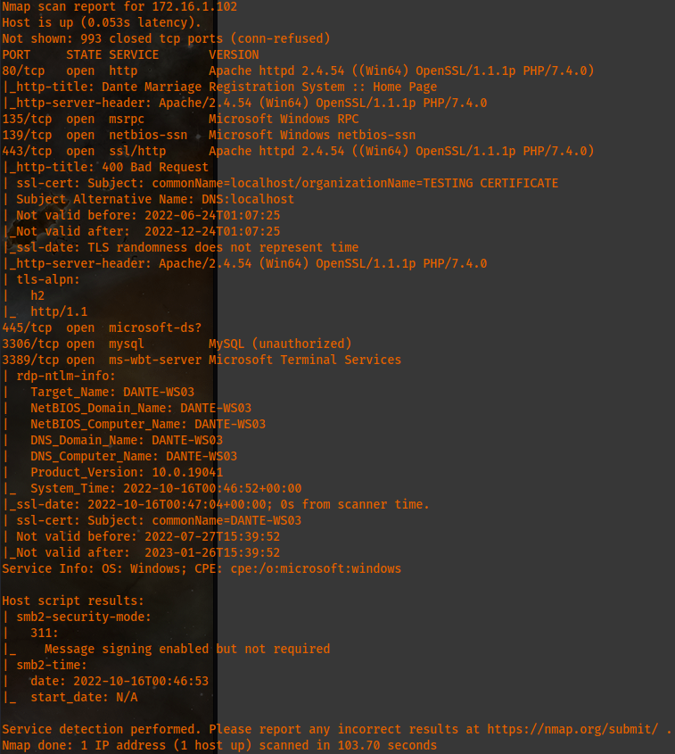
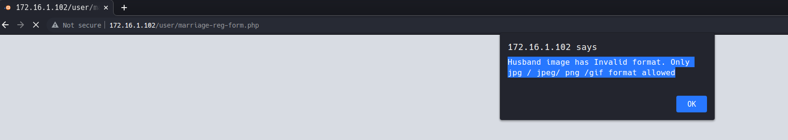
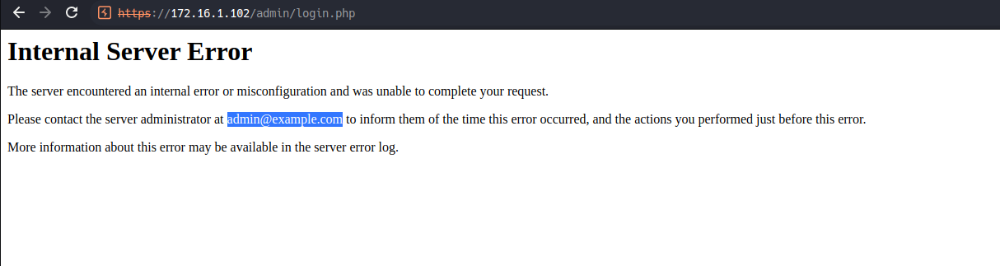

# Host [172.16.1.102](http://172.16.1.102):


In checking the website, it is a marriage application site. In attempting to quickly submit an application after filling it out, I obtained the following results.:


In attempting to find more about what I may be able to use to login as the admin, I found the following when selecting on the "Admin" option from the homepage which should allow me to attempt a bruteforce attack on the password reset page with random numbers as the phone number or using password lists on the regular admin login screen.


After checking the forums, it seems I need to conduct a buffer overflow on this machine but this comes after gaining the first flag as some of the comments mention having established a shell already.

### Alive Hosts After Port Scanning:

```
172.16.1.5
172.16.1.10
172.16.1.12
172.16.1.13
172.16.1.17
172.16.1.19
172.16.1.20
172.16.1.100 linked via SSH (22) to Dante-DC01.dante.local (172.16.1.20). I found this out with netstat on the DC after connecting via RDP.
172.16.1.101
172.16.1.102
```
