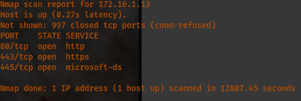
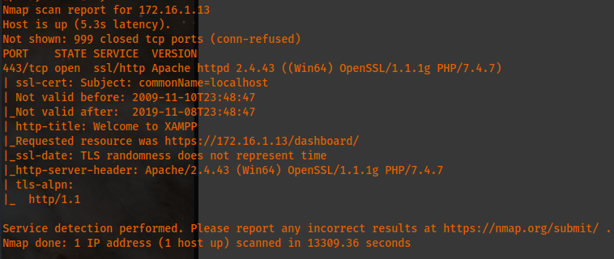

# Host [172.16.1.13](http://172.16.1.13):



Feroxbuster directory results:
```
302      GET        0l        0w        0c http://172.16.1.13/ => http://172.16.1.13/dashboard/
403      GET      42l      97w        0c http://172.16.1.13/webalizer
301      GET        9l      30w      332c http://172.16.1.13/img => http://172.16.1.13/img/
403      GET      45l      113w        0c http://172.16.1.13/phpmyadmin
MSG      0.000 feroxbuster::heuristics detected directory listing: http://172.16.1.13/img (Apache)
200      GET        5l        9w      337c http://172.16.1.13/img/module_table_top.png
301      GET        9l      30w      338c http://172.16.1.13/dashboard => http://172.16.1.13/dashboard/
200      GET        3l      16w      751c http://172.16.1.13/img/module_table_bottom.png
301      GET        9l      30w      341c http://172.16.1.13/dashboard/fr => http://172.16.1.13/dashboard/fr/
301      GET        9l      30w      341c http://172.16.1.13/dashboard/ru => http://172.16.1.13/dashboard/ru/
301      GET        9l      30w      341c http://172.16.1.13/dashboard/it => http://172.16.1.13/dashboard/it/
MSG      0.000 feroxbuster::heuristics detected directory listing: http://172.16.1.13/dashboard/Images (Apache)
MSG      0.000 feroxbuster::heuristics detected directory listing: http://172.16.1.13/dashboard/images (Apache)
301      GET        9l      30w      345c http://172.16.1.13/dashboard/Images => http://172.16.1.13/dashboard/Images/
200      GET      13l      93w    3361c http://172.16.1.13/dashboard/images/social-icons.png
301      GET        9l      30w      341c http://172.16.1.13/dashboard/es => http://172.16.1.13/dashboard/es/
301      GET        9l      30w      350c http://172.16.1.13/dashboard/javascripts => http://172.16.1.13/dashboard/javascripts/
301      GET        9l      30w      341c http://172.16.1.13/dashboard/pl => http://172.16.1.13/dashboard/pl/
MSG      0.000 feroxbuster::heuristics detected directory listing: http://172.16.1.13/dashboard/javascripts (Apache)
200      GET    5523l    16178w  188385c http://172.16.1.13/dashboard/javascripts/all.js
MSG      0.000 feroxbuster::heuristics detected directory listing: http://172.16.1.13/dashboard/stylesheets (Apache)
301      GET        9l      30w      336c http://172.16.1.13/discuss => http://172.16.1.13/discuss/
200      GET    9147l    36448w  481698c http://172.16.1.13/dashboard/stylesheets/all.css
200      GET    1407l    5561w    51365c http://172.16.1.13/dashboard/javascripts/modernizr.js
301      GET        9l      30w      350c http://172.16.1.13/dashboard/stylesheets => http://172.16.1.13/dashboard/stylesheets/
301      GET        9l      30w      341c http://172.16.1.13/dashboard/ro => http://172.16.1.13/dashboard/ro/
200      GET        8l      76w    2678c http://172.16.1.13/dashboard/images/fastly-logo@2x.png
200      GET    9147l    36448w  481810c http://172.16.1.13/dashboard/stylesheets/all-rtl.css
301      GET        9l      30w      332c http://172.16.1.13/IMG => http://172.16.1.13/IMG/
301      GET        9l      30w      343c http://172.16.1.13/dashboard/docs => http://172.16.1.13/dashboard/docs/
301      GET        9l      30w      341c http://172.16.1.13/dashboard/de => http://172.16.1.13/dashboard/de/
200      GET        0l        0w    17195c http://172.16.1.13/dashboard/Images/stack-icons.png
301      GET        9l      30w      341c http://172.16.1.13/dashboard/tr => http://172.16.1.13/dashboard/tr/
301      GET        9l      30w      341c http://172.16.1.13/dashboard/hu => http://172.16.1.13/dashboard/hu/
```
Additional directory results from /admin; Also check ferox4 file:
```
http://172.16.1.13/discuss/ 
[##>-----------------] - 16m    2971/20116  3/s    http://172.16.1.13/discuss/admin 
[##>-----------------] - 12m    2799/20116  3/s    http://172.16.1.13/discuss/Admin 
[####################] - 2s    20116/20116  0/s    http://172.16.1.13/discuss/db => Directory listing
[##>-----------------] - 16m    2390/20116  2/s    http://172.16.1.13/discuss/ADMIN 
[#>------------------] - 14m    1652/20116  1/s    http://172.16.1.13/discuss/DB 
[>-------------------] - 12m      478/20116  0/s    http://172.16.1.13/discuss/ups 
[>-------------------] - 5m        29/20116  0/s    http://172.16.1.13/discuss/Admin/ups
```

I found a cookie ID when curling out the <http://172.16.1.13/discuss/admin> webpage:
```
> GET /discuss/ADMIN/ HTTP/1.1
> Host: 172.16.1.13
> User-Agent: curl/7.85.0
> Accept: */*
>
* Mark bundle as not supporting multiuse
< HTTP/1.1 302 Found
< Date: Mon, 19 Sep 2022 00:00:47 GMT
< Server: Apache/2.4.43 (Win64) OpenSSL/1.1.1g PHP/7.4.7
< X-Powered-By: PHP/7.4.7
< Set-Cookie: PHPSESSID=pfhj94lqlplo5qlvv840t6n1eq; path=/
< Expires: Thu, 19 Nov 1981 08:52:00 GMT
< Cache-Control: no-store, no-cache, must-revalidate
< Pragma: no-cache
< location: ./login.php
< Content-Length: 3832
< Content-Type: text/html; charset=UTF-8
```
I found a file containing JPEGS and what seems to be usernames when analyzing it with Ghidra.:
