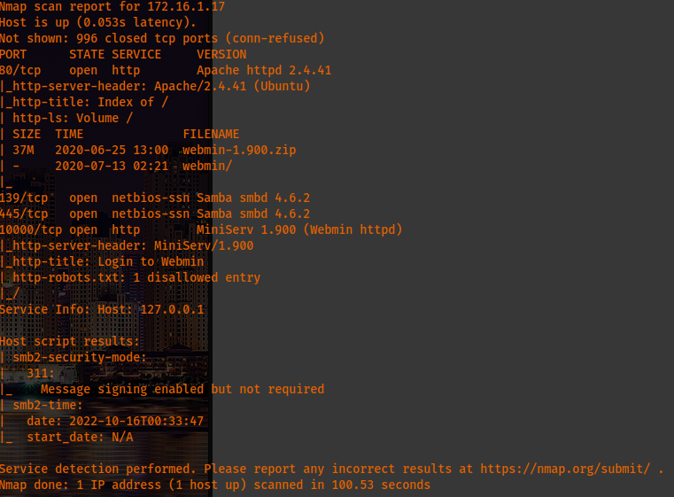
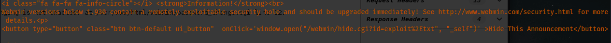
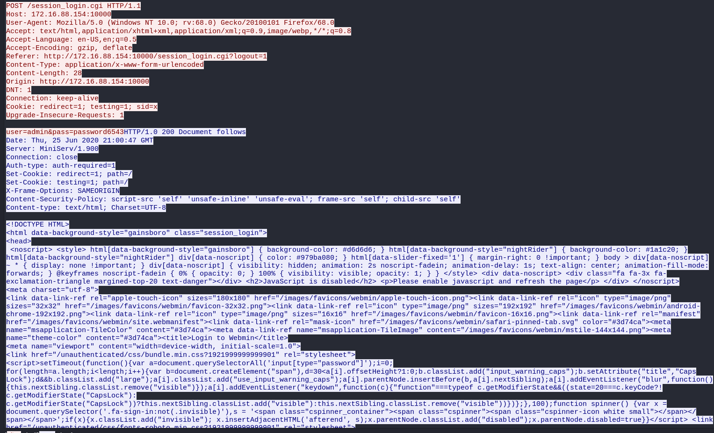
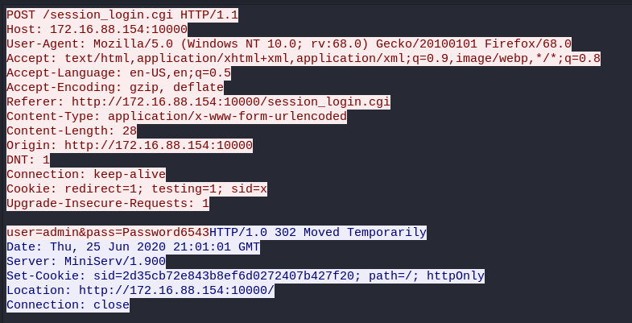
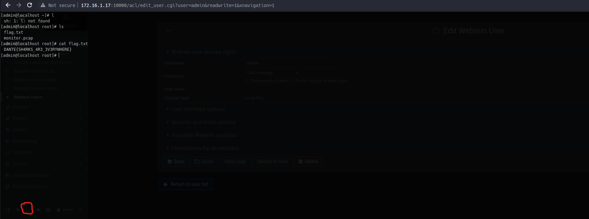
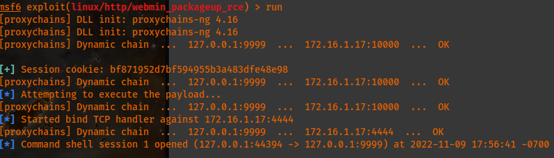

# Host [172.16.1.17](http://172.16.1.17):



In checking the above, a vulnerable Webmin server is being run on this linux machine. Per the below screenshot from 'monitor' document I downloaded from the available 'forensics' SMB share, the specific vulnerability is an RCE for change\_password.cgi file/function.  The followig MSF module can exploit this vuilnerability:
```
msf6 exploit(linux/http/webmin_backdoor)
```
site provides additional information: <https://pentest.com.tr/exploits/DEFCON-Webmin-1920-Unauthenticated-Remote-Command-Execution.html> and the following link was provided from the 'monitor' file: <http://www.webmin.com/security.html>

I found that the 'monitor' file was a pcap that opened with Wireshark automatically. I remembered the 'FINtastic' flag in the lab page and went ahead and followed the TCP stream which then allowed me to get credentials!:


I was able to login to the s<https://172.16.1.17:10000/session_login.cgi> using:
```
Uname: admin
passwd: Password6543
```

After accessing the site, I used the terminal option and I "ls" immediately which revealed the flag.txt.:


I can confirm that the vulnerability here is the following msfconsole exploit that takes advantage of the credentials for webmin and the activation of the upload and download modules which I've all confirmed. However, my issue is that the exploit timesout for some reason.:
```
linux/http/webmin_packageup_rce
```



It seems, after checking in Discord, this is in fact the only flag on this machine which I guess makes sense since I got the root flag first.