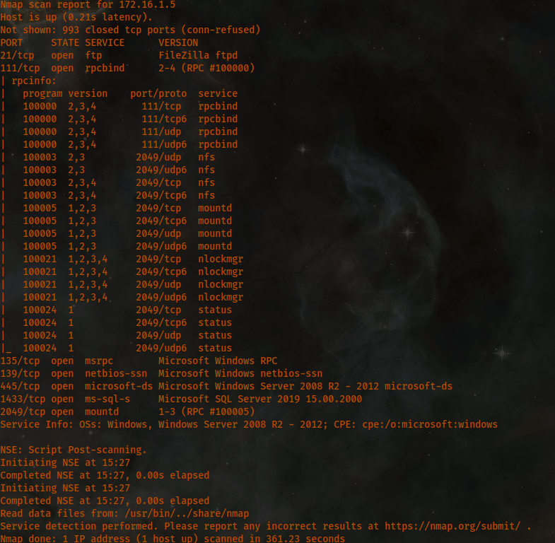
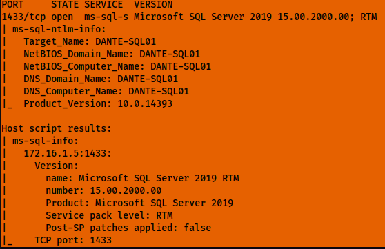
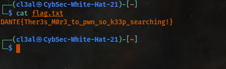

# Host [172.16.1.5](http://172.16.1.5):

```
Not shown: 993 closed tcp ports (conn-refused)
PORT    STATE SERVICE      VERSION
21/tcp  open  ftp          FileZilla ftpd
111/tcp  open  rpcbind      2-4 (RPC #100000)
135/tcp  open  msrpc        Microsoft Windows RPC
139/tcp  open  netbios-ssn  Microsoft Windows netbios-ssn
445/tcp  open  microsoft-ds Microsoft Windows Server 2008 R2 - 2012 microsoft-ds
1433/tcp open  ms-sql-s    Microsoft SQL Server 2019 15.00.2000
2049/tcp open  mountd      1-3 (RPC #100005)

Service Info: OSs: Windows, Windows Server 2008 R2 - 2012; CPE: cpe:/o:microsoft:windows
Service detection performed. Please report any incorrect results at https://nmap.org/submit/ .
Nmap done: 1 IP address (1 host up) scanned in 240.63 seconds
zsh: segmentation fault  proxychains nmap -sT -sV 172.16.1.5
```



After running Nmap vulns scripts, this machine is vulnerable to the following CVE: <https://nvd.nist.gov/vuln/detail/CVE-2012-1182#vulnCurrentDescriptionTitle>

Enumerating the host further for SQL info:


After using msfconsole by utilizing the resource file I had made for password spraying, I noticed shortly after that one credential actually allowed a successful login to occur on the host on FTP 21. I was able to then use the credentials (listed below) to access FTP and find the first flag on this machine with a hint.:

```
172.16.1.5:21        - 172.16.1.5:21 - Login Successful: anonymous:IEUser@
```

I found the first flag after logging into the machine via FTP and listing out the files. I saw flag.txt and used the "get" command to download that file.:


For the root flag, I need to figure out how to use xp\_cmdshell per Pillage from Discord. This should let me get access to the SQL server and acquire the root credentials I need to complete this one.