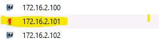
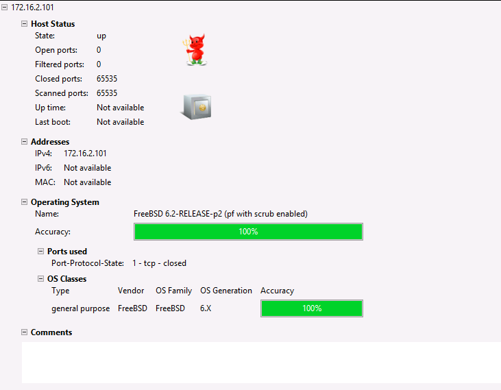
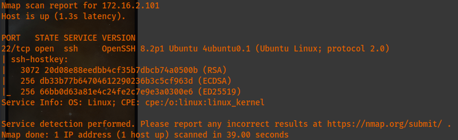
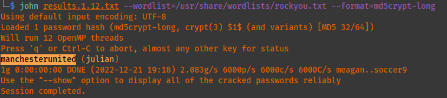
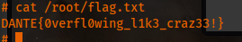

**Host 172.16.2.101:**

I missed this before but in running more nmap scans, this system stands out among all other failed hosts when running this from the .2.5 machine. This is nix05 a Linux machine. Here are some more details.:

\*\*\*I need to use katwamba's id\_rsa key to access the .20 DC. Then, change katwamab's password and access the machine via rdp to setup chisel and add the socks port to etc/proxychains4.conf. From there, I can continue investigating .2.101 (this nix05) machine. Comment out 9999 and uncomment 389 socks ports.\*\*\*

It seems that the only port that appears to be open is SSH as shown below.:


```
PORT  STATE SERVICE VERSION
22/tcp open  ssh    OpenSSH 8.2p1 Ubuntu 4ubuntu0.1 (Ubuntu Linux; protocol 2.0)
| ssh-hostkey: 
|  3072 20d08e88eedbb4cf35b7dbcb74a0500b (RSA)
|  256 db33b77b64704612290236b3c5cf963d (ECDSA)
|_  256 66bb0d63a81e4c24fe2c7e9e3a0300e6 (ED25519)
Service Info: OS: Linux; CPE: cpe:/o:linux:linux_kernel
Service detection performed. Please report any incorrect results at https://nmap.org/submit/ .
Nmap done: 1 IP address (1 host up) scanned in 39.00 seconds
```

So after getting a nude from discord, the way to access this machine is with a user and password from [172.16.1.12](http://172.16.1.12) that I saw but totally did not think much of it. The information is:
```
uname: julian
password hash: julian:$1$CrackMe$U93HdchOpEUP9iUxGVIvq/:18439:0:99999:7:::
cracked hash: manchesterunited
```

The combined unshadowed file is on the Desktop as: **_results.1.12.txt_** and just needs to be cracked with john which can take some time.



Vulnerable to CVE-2021-4034

Vulnerable to CVE-2021-3560

Using the first CVE once again to quickly escalate privileges, I obtained the root flag. However, I have yet to find the user flag here. Also, I saved the passwd and shadow file information to my Desktop as **_shadow.2.101.txt_** and **_passwd.2.101.txt_** respectively. I can use the unshadow command to combine both for john to then crack. Check the history for the correct command.


Apparently, I unintendedly escalated privs NOT through the BoF lol. I will wanna redo this so I can learn this one. Check John Hammond's video on it and also check out: <https://valsamaras.medium.com/introduction-to-x64-linux-binary-exploitation-part-1-14ad4a27aeef> for resources. Apart from that, this is the only flag on the machine apparently and the sql01 credentials are NOT here which is another conundrum. I will need to figure that out somehow.

I was able to transfer linpeas and use the following commands to perform a network enumeration scan which now allowed me to discover the [172.16.2.6](http://172.16.2.6) machine. :
```
chmod +x linpeas.sh
./linpeas.sh -d 172.16.2.0/24
```