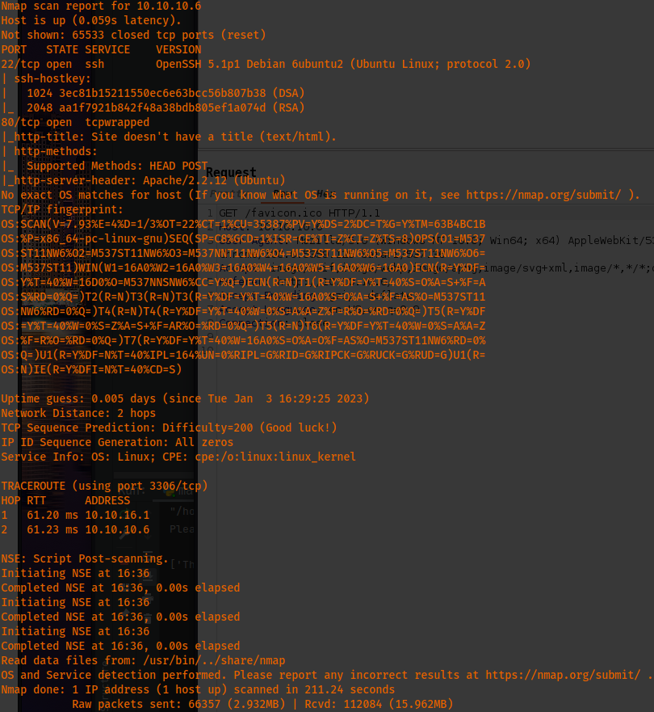
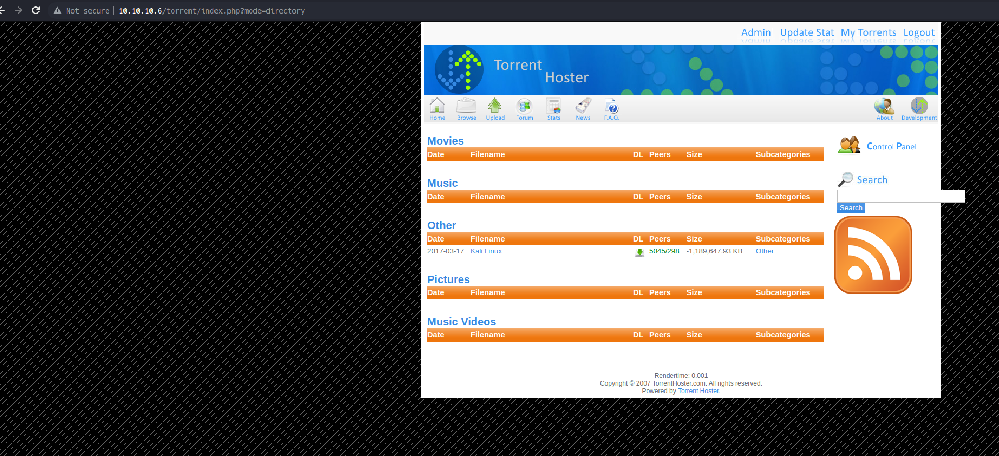
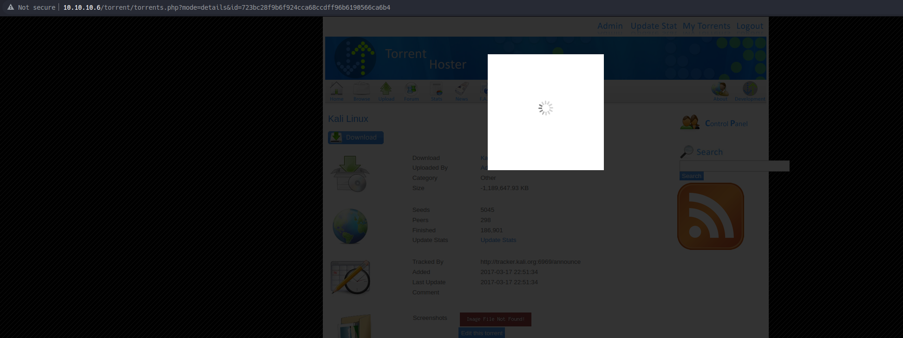
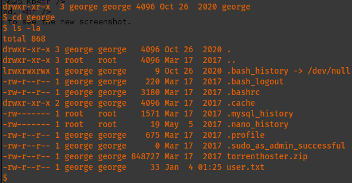

# HTB Popcorn

Nmap basic scan:


Nmap aggressive scan:

Large feroxbuster results with small-directories wordlist.:

In checking the URL from above: <http://10.10.10.6/torrent/database/th_database.sql> the bottom part of the file shows a username "Admin" and what to my eye looked like a hash value. When using crackstation, it cracked the MD5 hash providing what looks like a possible password.:
```
-- phpMyAdmin SQL Dump
-- version 2.10.1
-- http://www.phpmyadmin.net
-- 
-- Host: localhost
-- Generation Time: Jun 03, 2007 at 09:00 PM
-- Server version: 5.0.41
-- PHP Version: 4.4.7
SET SQL_MODE="NO_AUTO_VALUE_ON_ZERO";
-- 
-- Database: `torrenthoster`
-- 
-- --------------------------------------------------------
-- 
-- Table structure for table `ban`
-- 
CREATE TABLE `ban` (
  `ip` varchar(60) NOT NULL default '',
  `reason` varchar(255) NOT NULL default ''
) ENGINE=MyISAM DEFAULT CHARSET=latin1;
-- 
-- Dumping data for table `ban`
-- 
-- --------------------------------------------------------
-- 
-- Table structure for table `categories`
-- 
CREATE TABLE `categories` (
  `id` int(10) unsigned NOT NULL auto_increment,
  `name` varchar(30) NOT NULL default '',
  `image` varchar(255) NOT NULL default '',
  `weight` int(3) unsigned NOT NULL default '0',
  PRIMARY KEY  (`id`)
) ENGINE=MyISAM  DEFAULT CHARSET=latin1 AUTO_INCREMENT=29 ;
-- 
-- Dumping data for table `categories`
-- 
INSERT INTO `categories` VALUES (4, 'Pictures', '4', 4);
INSERT INTO `categories` VALUES (3, 'Other', '3', 3);
INSERT INTO `categories` VALUES (2, 'Music', '2', 2);
INSERT INTO `categories` VALUES (1, 'Movies', '1', 1);
INSERT INTO `categories` VALUES (5, 'Music Videos', '5', 5);
-- --------------------------------------------------------
-- 
-- Table structure for table `comments`
-- 
CREATE TABLE `comments` (
  `id` varchar(50) NOT NULL default '0',
  `ip` varchar(40) NOT NULL default '',
  `post` varchar(255) NOT NULL default '',
  `date` datetime NOT NULL default '0000-00-00 00:00:00',
  `name` varchar(60) NOT NULL default '',
  KEY `id` (`id`)
) ENGINE=MyISAM DEFAULT CHARSET=latin1;
-- 
-- Dumping data for table `comments`
-- 
-- --------------------------------------------------------
-- 
-- Table structure for table `log`
-- 
CREATE TABLE `log` (
  `ip` varchar(255) NOT NULL default '',
  `date` varchar(255) NOT NULL default ''
) ENGINE=MyISAM DEFAULT CHARSET=latin1;
-- 
-- Dumping data for table `log`
-- 
INSERT INTO `log` VALUES ('127.0.0.1', '20070602105208');
-- --------------------------------------------------------
-- 
-- Table structure for table `namemap`
-- 
CREATE TABLE `namemap` (
  `info_hash` varchar(40) NOT NULL default '',
  `filename` varchar(250) NOT NULL default '',
  `filename2` varchar(40) NOT NULL default '',
  `url` varchar(250) NOT NULL default '',
  `info` varchar(250) NOT NULL default '',
  `data` datetime NOT NULL default '0000-00-00 00:00:00',
  `size` bigint(20) NOT NULL default '0',
  `comment` text,
  `category` int(10) unsigned NOT NULL default '6',
  `subcategory` int(11) NOT NULL default '0',
  `announce_url` varchar(100) NOT NULL default '',
  `uploader` varchar(40) NOT NULL default 'Guest',
  `lastupdate` datetime NOT NULL default '0000-00-00 00:00:00',
  `anonymous` enum('true','false') NOT NULL default 'false',
  `autoupdater` varchar(100) NOT NULL default '0',
  `seeds` int(10) default '0',
  `leechers` int(10) default '0',
  `finished` int(10) default '0',
  `registration` enum('true','false') NOT NULL default 'false',
  `download` varchar(10) NOT NULL default '0',
  `screenshot` varchar(200) NOT NULL default 'noss.png',
  PRIMARY KEY  (`info_hash`)
) ENGINE=MyISAM DEFAULT CHARSET=latin1;
-- 
-- Dumping data for table `namemap`
-- 
-- --------------------------------------------------------
-- 
-- Table structure for table `news`
-- 
CREATE TABLE `news` (
  `news_id` mediumint(8) unsigned NOT NULL auto_increment,
  `title` tinytext NOT NULL,
  `content` text NOT NULL,
  `author` varchar(16) NOT NULL default '',
  `email` varchar(50) default NULL,
  `date` varchar(10) NOT NULL default '',
  `time` varchar(8) NOT NULL default '',
  PRIMARY KEY  (`news_id`)
) ENGINE=MyISAM  DEFAULT CHARSET=latin1 AUTO_INCREMENT=17 ;
-- 
-- Dumping data for table `news`
-- 
INSERT INTO `news` VALUES (13, '&#956;Torrent', 'µTorrent (also microTorrent or uTorrent) is a freeware proprietary BitTorrent client for Microsoft Windows written in C++, and localized for many different languages. It is designed to use minimal computer resources while offering functionality comparable to clients such as Azureus or BitComet. The program has received consistently good reviews for its feature set, performance, stability, and support for older hardware and versions of Windows. It has been in active development since its first release in 2005. Its name is commonly abbreviated "µT" or "uT". On December 7, 2006, µTorrent developer Ludvig Strigeus and BitTorrent, Inc. CEO Bram Cohen announced that BitTorrent, Inc. had acquired µTorrent.', 'Admin', NULL, '2007-06-01', '');
INSERT INTO `news` VALUES (12, 'Azureus', 'Azureus (Ah/ZURE/us) is a Java-based BitTorrent client, with support for I2P and Tor anonymous communication protocols. The core developers of Azureus have formed a company called Azureus, Inc.\r\n\r\nThe program''s logo is the Blue Poison Dart Frog (Dendrobates azureus), shown on the Azureus webpage, as well as within the program''s start-up splash screen, from which the project took its name. The name was given to the project by co-creator Tyler Pitchford, who uses the Latin names of Poison Dart Frogs as codenames for his development projects.\r\n', 'Admin', NULL, '2007-06-01', '');
INSERT INTO `news` VALUES (11, 'BitTorrent From Wikipedia', 'BitTorrent (BT) is a peer-to-peer (P2P) communications protocol for file sharing. The protocol was designed in April 2001, implemented and first released July 2, 2001[1] by programmer Bram Cohen, and is now maintained by BitTorrent, Inc. BitTorrent is a method of distributing large amounts of data widely without the original distributor incurring the entire costs of hardware, hosting and bandwidth resources.\r\n', 'Admin', NULL, '2007-06-01', '');
INSERT INTO `news` VALUES (14, 'BitTornado', 'BitTornado is a BitTorrent client. It is developed by John Hoffman, who also created its predecessor, Shad0w''s Experimental Client. Based on the original BitTorrent client, the interface is largely the same, with added features such as:\r\n\r\nupload/download speed limitation \r\nprioritised downloading when downloading batches (several files) \r\ndetailed information about connections to other peers \r\nUPnP Port Forwarding (Universal Plug and Play) \r\nIPv6 support (if your OS supports it/has it installed) \r\nPE/MSE support as of version 0.3.18.\r\n', 'Admin', NULL, '2007-06-01', '');
-- --------------------------------------------------------
-- 
-- Table structure for table `subcategories`
-- 
CREATE TABLE `subcategories` (
  `id` int(10) NOT NULL auto_increment,
  `catid` int(10) NOT NULL default '0',
  `name` varchar(30) NOT NULL default '',
  PRIMARY KEY  (`id`)
) ENGINE=MyISAM  DEFAULT CHARSET=latin1 AUTO_INCREMENT=152 ;
-- 
-- Dumping data for table `subcategories`
-- 
INSERT INTO `subcategories` VALUES (34, 5, 'Rap');
INSERT INTO `subcategories` VALUES (35, 5, 'Rock');
INSERT INTO `subcategories` VALUES (32, 5, 'Punk');
INSERT INTO `subcategories` VALUES (33, 5, 'R&B');
INSERT INTO `subcategories` VALUES (31, 5, 'Pop');
INSERT INTO `subcategories` VALUES (30, 5, 'Hip Hop');
INSERT INTO `subcategories` VALUES (27, 4, 'Wallpapers');
INSERT INTO `subcategories` VALUES (26, 4, 'Other');
INSERT INTO `subcategories` VALUES (25, 3, 'Religion');
INSERT INTO `subcategories` VALUES (24, 3, 'Other');
INSERT INTO `subcategories` VALUES (23, 3, 'Manuals');
INSERT INTO `subcategories` VALUES (22, 3, 'Funny clips');
INSERT INTO `subcategories` VALUES (21, 3, 'Flash/Shockwave');
INSERT INTO `subcategories` VALUES (20, 3, 'Comics');
INSERT INTO `subcategories` VALUES (19, 3, 'Articles');
INSERT INTO `subcategories` VALUES (18, 2, 'Soundtracks');
INSERT INTO `subcategories` VALUES (17, 2, 'Rock');
INSERT INTO `subcategories` VALUES (16, 2, 'Rap');
INSERT INTO `subcategories` VALUES (15, 2, 'R&B');
INSERT INTO `subcategories` VALUES (14, 2, 'Punk');
INSERT INTO `subcategories` VALUES (13, 2, 'Pop');
INSERT INTO `subcategories` VALUES (12, 2, 'Hip Hop');
INSERT INTO `subcategories` VALUES (11, 2, 'Classic');
INSERT INTO `subcategories` VALUES (10, 2, 'Alternative');
INSERT INTO `subcategories` VALUES (9, 1, 'Thriller');
INSERT INTO `subcategories` VALUES (8, 1, 'Romance');
INSERT INTO `subcategories` VALUES (7, 1, 'Martial Arts');
INSERT INTO `subcategories` VALUES (6, 1, 'Horror');
INSERT INTO `subcategories` VALUES (5, 1, 'Family');
INSERT INTO `subcategories` VALUES (4, 1, 'Drama');
INSERT INTO `subcategories` VALUES (1, 1, 'Action');
INSERT INTO `subcategories` VALUES (2, 1, 'Adventure');
INSERT INTO `subcategories` VALUES (3, 1, 'Comedy');
INSERT INTO `subcategories` VALUES (29, 5, 'Classic');
INSERT INTO `subcategories` VALUES (28, 5, 'Alternative');
-- --------------------------------------------------------
-- 
-- Table structure for table `users`
-- 
CREATE TABLE `users` (
  `id` int(10) unsigned NOT NULL auto_increment,
  `userName` varchar(40) NOT NULL default '',
  `password` varchar(40) NOT NULL default '',
  `privilege` varchar(10) NOT NULL default '',
  `email` varchar(30) NOT NULL default '',
  `joined` datetime NOT NULL default '0000-00-00 00:00:00',
  `lastconnect` datetime NOT NULL default '0000-00-00 00:00:00',
  PRIMARY KEY  (`id`),
  UNIQUE KEY `userName` (`userName`)
) ENGINE=MyISAM  DEFAULT CHARSET=latin1 AUTO_INCREMENT=4 ;
-- 
-- Dumping data for table `users`
-- 
INSERT INTO `users` VALUES (3, 'Admin', '1844156d4166d94387f1a4ad031ca5fa', 'admin', 'admin@yourdomain.com', '2007-01-06 21:12:46', '2007-01-06 21:12:46');
```


In attempting to access the machine via SSH, it is configured to accept a key for remote access. The credentials found probably work for the login I found earlier.
```
uname: admin
passwd: admin12
```

The credentials seem to not work at the http://10.10.10.6/torrent/login.php . However, In attempting to check for SQL Injection vulnerabilities, I was able to trigger the following confirming that the MySQL db is vulnerable to injection with: admin' --


After bruteforcing this with Burpsuite using my custom SQL wordlist in Evernote, I was able to get a status OK (200) with the following which allowed me to login as admin!:


```
uname: admin' #
passwd: admin' #
```



After investigating the site, there is an upload functionality that I tried to exploit using a php reverse shell. However, I kept getting the error: "Invalid file". I also tried uploading the php reverse shell using functionality to upload a an image when editing the already existing torrent in the site. However, I got the same error. Apparently, I can just modify the request in burp that contains the php code by changing the **CONTENT TYPE:** parameter to image/png. In doing so, and resending the request through burp, allowed it to actually go through. Finally, I just need to click on the **_"image file not found!"_** to execute it which allowed me to get a low privilege shell!:


In browsing the home directory, I found a new user george and obtained the user.txt flag.:

user flag:
```
03d92205128a74f290c4696087eb1748
```

After nothing working, I checked for a clue and apparently, the file in the user's directory: "[motd.legal-display](http://motd.legal-display)" is an uncommon file I overlooked. In searching this online, exploitdb immediately shows an exploit for this.:
<https://www.exploit-db.com/exploits/14339>. However, the exploit fails as it kept asking me for the password for www-data. This is strange since it seemed to have worked for other users. I then checked and used another exploit called full-nelson which can be found here.: http://vulnfactory.org/exploits/full-nelson.c

I downloaded the file, then uploaded it to the target machine and ran per the script's instructions before making it executable.:
```
gcc full-nelson.c -o full-nelson
chmod +x full-nelson
```
After running this file, I obtained root and got the last flag.

**_###ROOTED!!!###_**
