# Hack The Box Bolt Report

Step #1:

After running my typical Nmap scan, I obtained the following results:
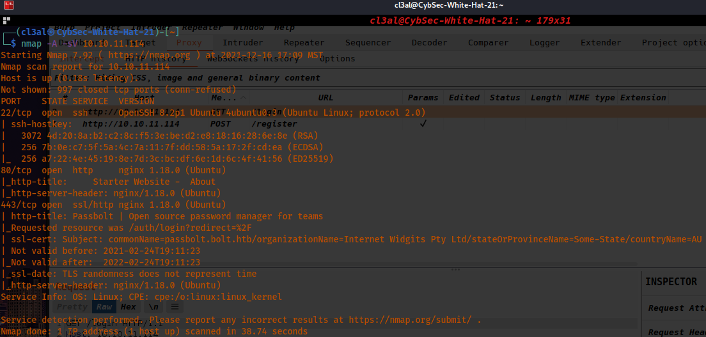)
Step #2:

From here, I accessed the website since port 80 is opened and it has a lot of information and several pages including a page to login, another page to create an account and also a page for customers to get in contact with the company by submitting an email, test, etc.

When attempting to create an account, I get a 500 error stating the server was being overloaded or that there was an error with the server internally where it was unable to process my request. I verified this using Burpsuite.

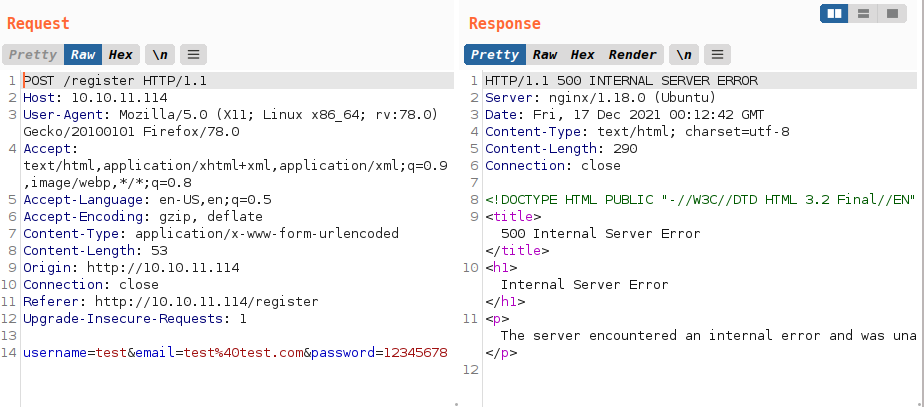)

Step #3:

To check input validation, I entered admin and password for login credentials in the login page to see what errors would show. It resulted in telling me that the password specifically was incorrect which leads me to think that perhaps the username "admin" is correct and found in the database.
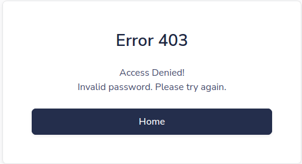)

When attempting to use random credentials to login, I get an error stating that the credentials are invalid.

Step #4:

I tried doing a dictionary attack with Burpsuite using fasttrack.txt but this did not result in any successful logins. I proceeded to brute-force directories to see if anything was hidden and this is what I found:
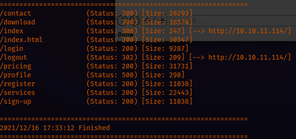)
When checking the request to logout, I obtained a cookie/Session ID:
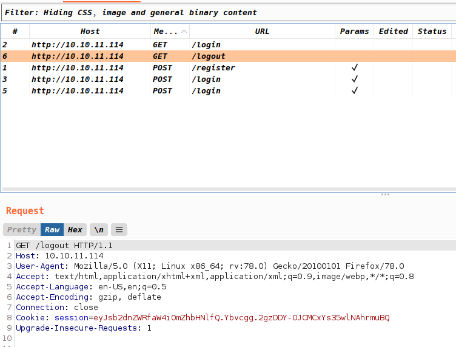)

```
Cookie: session=eyJsb2dnZWRfaW4iOmZhbHNlfQ.Ybvcgg.2gzDDY-OJCMCxYs35wlNAhrmuBQ
```

Step #5:

When going to the downloads page and downloading the file it offers as a docker container, I received a .tar file which I then extracted to reveal multiple files. One of them contained the following information:
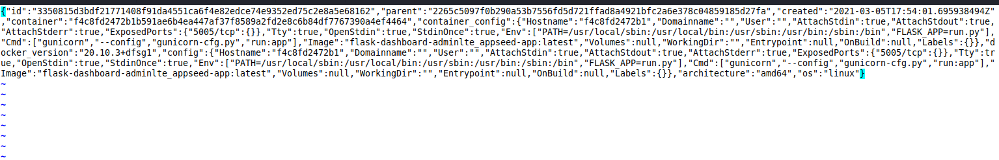)
I also found the following information in another file:
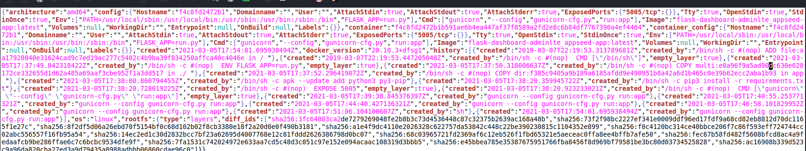)
I also ran a Nikto Web scan but I'm still stuck after checking each directory.
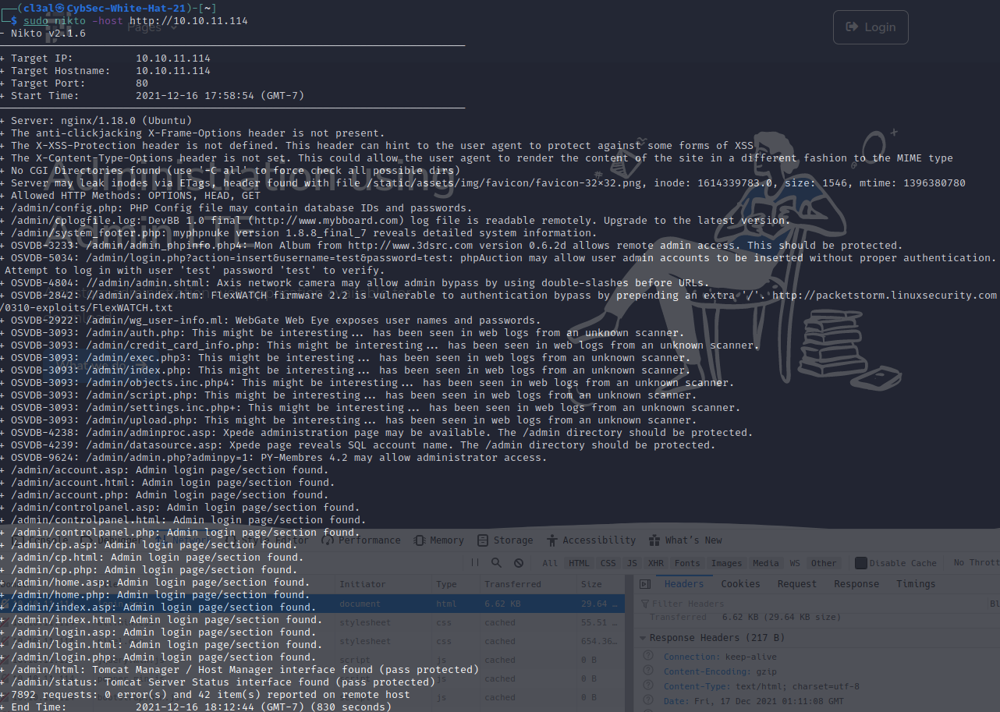)

After doing some digging online, apparently some important creds can be found in the image.tar directory I have on-prem. I've spent a considerable amount of time looking but I need to continue as the creds are buried in here somewhere. In continuing my investigation, I found a password in the following directory: /home/cl3al/Downloads/image/745959c3a65c3899f9e1a5319ee5500f199e0cadf8d487b92e2f297441f8c5cf/
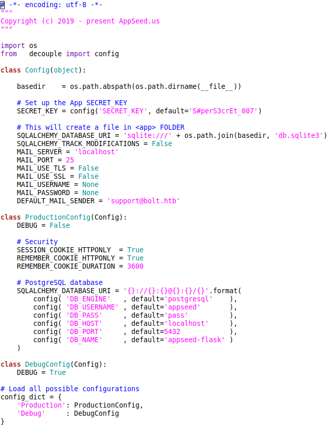)

* Next, I checked the following directory: /home/cl3al/Downloads/image/a4ea7da8de7bfbf327b56b0cb794aed9a8487d31e588b75029f6b527af2976f2/ and found the following in a DB:

```
$1$sm1RceCh$rSd3PygnS/6jlFDfF2J5q.
```

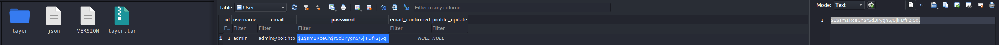)
I also found an invitation code in the following directory: /home/cl3al/Downloads/image/41093412e0da959c80875bb0db640c1302d5bcdffec759a3a5670950272789ad/
```
XNSS-HSJW-3NGU-8XTJ
```
The following file tells me it is an MD5 hash so I was then able to use john to crack it very quickly bvy pasting the hash in a new txt file on my desktop.
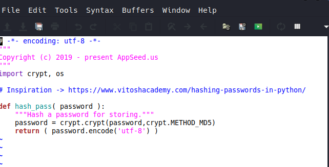)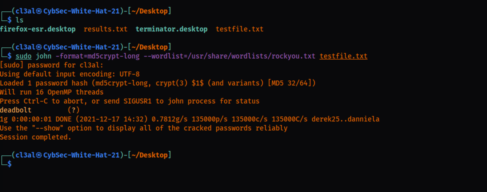)

Step #6:

Next, After accessing the admin's account, the dashboard shows a lot of information. I found that Alexander Pierce mentioned a email security issue of concern to Sarah Bullock.  After some investigation, FFUF is apparently better than gobuster which I think I will be sticking to from now on. Additionally, the next clue is to search for and find directories under <http://demo.bolt.htb>. However, in doing so, nothing is returned for some reason. I will continue this attempt another time.
